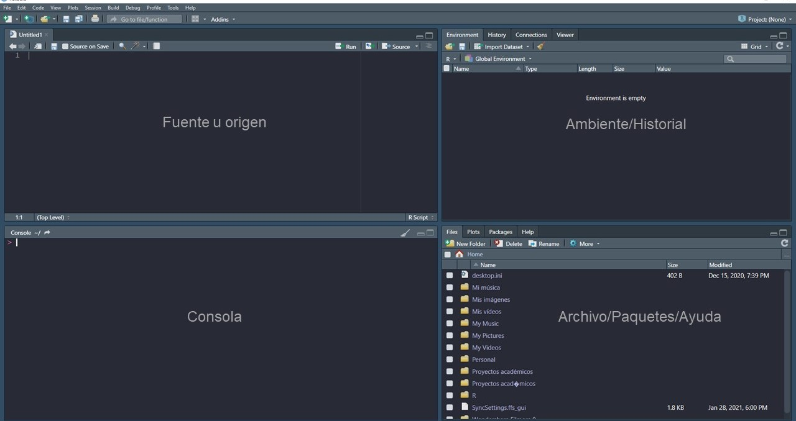

# R: Una introducción desde la exploración de información

## R: Lenguaje de programación y plataforma de análisis

<div style="text-align: justify">
R es un lenguaje de programación orientado a objetos, libre y de código abierto y además un ambiente enfocado al análisis estadístico y gráfico. Que sea libre significa, a diferencia de otros programas, que cualquier persona puede usarlo, redistribuirlo o modificarlo, sin necesidad de contar con una licencia pago.  

> R es un entorno de software libre para computación estadística y gráficos. Compila y se ejecuta en una amplia variedad de plataformas UNIX, Windows y MacOS. Fuente: \ [http://cran.r-project.org](http://cran.r-project.org)\

Usar R en lugar de otras plataformas que requieren licencia pago es recomendable al menos por tres razones:

i.  Es libre: en contraste con otros populares programas informáticos como lo es STATA, del que una licencia sencilla ronda los 100 dólares por año.\
ii. R no es sólo un software, también es un lenguaje de programación; así, al aprenderlo se obtiene un resultado doble. De modo que cuando llegues a manejarlo con profundidad, puedes crear tus propias librerías. No sólo sirve para hacer análisis gráfico y estadístico, con el puedes hacer páginas web, ser usado como Sistema de Información Geográfica e incluso para escribir libros, como éste que ahora estas leyendo.
iii. Es un lenguaje con un amplio soporte, es decir, con multitud de guías y materiales para el autoaprendizaje.

A lo largo de este libro usaremos R a través de [*RStudio*](https://es.wikipedia.org/wiki/RStudio), un entorno de desarrollo integrado o IDE por sus siglas en inglés. Así que, lo primero será descargar e instalar R y luego descargar e instalar RStudio.

R puede ser descargado de [aquí](https://www.r-project.org/). Al seleccionar *"download R"* hay que elegir cualquier CRAN Mirror (del inglés *Comprehensive R Archive Network* que son repositorios que contienen una copia del código base de R y sus paquetes). México tiene dos, puedes elegir cualquiera.

En tanto, R Studio puede ser desargado de [aquí](https://www.rstudio.com/). Ve a la sección *"Download"* en la parte superior y elije la versión gratuita. El navegador debería seleccionar la versión adecuada para tu equipo, sino es así, selecciona del listado que aparece en la parte inferior. También puedes consultar [este video](https://youtu.be/zlnm1jLWLeE) para seguir paso a paso la instalación de ambos programas.

Al abrir RStudio se mostrará una pantalla como la que aparece en la figura 1.1. La pantalla principal de RStudio está dividida en cuatro partes. En caso de que el recuadro superior izquierdo no aparezca, da clic en el ícono de la hoja en blanco con el signo de más (*New file*, parte superior izquierda de la pantalla) para que se despliegue.

```{r, echo=FALSE, fig.align='center',out.width='100%',fig.cap='Panel principal'} 

```

Las citadas cuatro secciones son:

-   Fuente u origen (*source*): esta sección, zona superior izquierda, aparecerá una vez que des clic en *New script*. Aquí podrás escribir las líneas de código de tu proyecto y guardarlas para consultarlas cuando lo desees, visualizarás tus bases de datos organizadas en pestañas y varios otros elementos.
-   Consola: localizada en la parte inferior izquierda, es donde aparece el puntero o *prompt* (\>); este es el espacio en el que se insertarán o escribirán las líneas de código para ser ejecutadas por R y en donde se mostrarán parte de los resultados. Cuando el *prompt* aparezca, R está listo para recibir tus instrucciones.
-   Archivo: en el espacio inferior derecho aparecen una serie de pestañas que muestran las carpetas y archivos de tu equipo, las gráficas realizadas y los paquetes disponibles, así como la ayuda de R y de sus paquetes.
-   Ambiente: por último el área superior derecha, mostrará las variables creadas, bases de datos cargadas y todos los objetos activos en la sesión de R. Esta sección contiene otras dos pestañas: historial y conexiones. La primera ofrece una memoria de todas las instrucciones escritas en la consola, en tanto, la segunda le será útil cuando haga trabajo colaborativo a través de, por ejemplo, GitHub.

## Códigos, objetos, paquetes

### Código

<div style="text-align: justify">
Los programas informáticos están construidos a partir de código, éste puede ser entendido como un lenguaje a partir del cual se dan las instrucciones a la computadora para que realice alguna acción. Como en todo lenguaje, un aspecto sustantivo es la sintaxis y la ortografía, es decir, el orden y la corrección en la forma en que uno se comunica con el sistema de cómputo, de modo que si se escribe alguna instrucción de forma incorrecta o incompleta (faltas de ortografía o errores de sintaxis) la instrucción no se ejecutará.

En este sentido, se debe señalar que R es sensible al uso de mayúsculas y minúsculas, esto quiere decir para nuestro programa no es lo mismo Árbol y árbol. Además, en este programa constantemente estará usando paréntesis y comas en las instrucciones, por lo que hay que poner especial atención para no olvidar colocar alguno de ellos en la sentencia escrita. Otro elemento importante son las llamadas "palabras clave", *Keywords*. Éstas son palabras reservadas, es decir, palabras con un significado especial para R y que hacen referencia a instrucciones que pertenecen a la estructura base del programa R por lo que no está recomendado su uso. Algunos ejemplos de palabras reservadas son son: *if*, *else*, *break*. Además, el nombre de las variables no debe comenzar con caracteres especiales (&,\#,\$,%) o números.

### Objetos, operadores y tipos de variables
<div style="text-align: justify">
Si bien R es tremendamente potente, puede incluso utilizarse como simple calculadora. Los operadores matemáticos que pueden emplearse en R se muestran en la figura 1.2:

```{r, echo=FALSE, fig.align='center',out.width='120%', fig.cap='Operadores'} 
knitr::include_graphics("recursos intro/Figura_2-Operadores.jpg")
```

De esta forma sí colocas en la consola el número `5` seguido del signo aritmético correspondiente, por ejemplo un signo de más, `+`, y luego otro número, R devolverá el resultado de la operación:

```{r}
5+10
```

En R, todos los elementos con los que se interactúa son denominados objetos (por eso se dice que es un lenguaje de programación orientado a objetos), los hay de distintas clases y cada clase se puede identificar por un nombre. Los objetos más comunes en R son: constantes, variables, vectores, listas, matrices y arreglos de datos (*data frames*). Éstos últimos los hay en diferentes versiones dependiendo de algunas de sus características.

Los objetos pueden contener diferentes tipos de información como: números enteros (*integer*), valores numéricos (*numeric*), números complejos (*complex*) o valores lógicos (*logic*) y de cadena/texto (*character*). Distinguir entre los tipos de información que contiene cada objeto es importante para conocer las operaciones que se pueden hacer entre ellos. Por ejemplo, no es posible hacer operaciones matemáticas con variables tipo *character* ya que no tiene sentido sumar aritméticamente "casa" y "azul", pero sí es posible concatenarlos.

Para crear objetos, en R se utiliza el singo "menor que" seguido de un guion para formar una suerte de flecha que apunta a la izquierda, `<-`, éste singo es llamado **operador de asignación** y precisamente asigna contenido a objetos, es decir, con el operador `<-` creamos un objeto que tendrá determinado contenido. Ve a la sección consola de tu entorno de trabajo e ingresa las siguientes líneas de instrucciones (o simplemente da click en el ícono de copiar que aparece en la esquina superior derecha del cuadro que contiene el código):

```{r}
x <- 3 #Numérico
y <- "Hello World" #Carácter 
z <- FALSE # Lógico
```

Tras haber escrito estas líneas de código notarás que en la sección superior derecha de RStudio aparecen, en la pestaña de ambiente, los tres objetos creados, cada uno con un nombre y contenido diferente entre ellos: `x` es un objeto numérico, `y` es una cadena de texto o carácter y `z` contiene un valor lógico. Basta con escribir el nombre del objeto en la consola para ver su contenido.

Ahora, vuelve a crear un objeto de nombre `x` que contenga el resultado de la suma de 5+10:

```{r}
x <- 5+10
```

Como es posible identificar, si en una sesión de R se utiliza dos veces el mismo nombre para una variable, se sobrescribe la información asignada a esa variable, es decir, sólo permanece el último valor asignado: `x` ya no contiene la primera asignación, 3, solamente la última, 15.

Hay dos funciones muy útiles para conocer el tipo de objeto que tenemos en nuestro entorno de trabajo: La función `class()` y la función `str()`. La primera indica el tipo de objeto, en tanto, la segunda nos dice el tipo de objeto y su valor. En el siguiente ejemplo puedes ver que el objeto `y` es de tipo carácter y su contenido es la expresión "Hello World".

```{r}
class(y)
str(y)
```

#### Vectores
<div style="text-align: justify">
Los vectores son una forma de almacenar más de un elemento en un objeto y dichos elementos no tienen que ser necesariamente del mismo tipo, aunque es importante tener en cuenta que no es recomendable combinar diferentes tipos de objetos porque se pueden alterar las clases de cada uno de los elementos originales. Cuando se quiere crear un vector que contiene cadenas de texto, cada cadena (palabra u oración) se debe poner entre comillas, como se ilustra a continuación:

```{r}
x <- c("a","v")
x
```

El uso de vectores es útil para modificar las etiquetas de una gráfica o bien los encabezados de una tabla, ya que R tomará los valores de texto almacenados en el vector para utilizarlos en la forma deseada. Aquí se muestran otros tipos de objetos en un vector:

```{r}
x <- c("a","v")
x
x <- c(TRUE,FALSE)
x
x<- c(4+5i,3+2i)
x
```

Imagina que deseas crear un vector numérico con una secuencia numérica del 1 al 10. Para hacerlo, deberías proceder como:

```{r}
x<-c(1:10)
x
```

Es decir, no fue necesario insertar en el vector cada uno de los 10 números, sino que la secuencia continua (del 1 al 10) se señaló con los dos puntos.

#### Matrices
<div style="text-align: justify">
Las matrices son un tipo de objeto que se distingue porque entre sus propiedades está el de tener dimensión (filas y columnas). Se puede generar una matriz en R con la función `matrix()` y se procede como:

```{r}
m <- matrix(data=1:6,nrow = 2,ncol = 3)
```

Las funciones, tanto las previamente citadas como esta, requieren que el usuario indique **argumentos** que son los elementos que aparecen entre paréntesis. La función `matrix()` requirió indicar varios: los datos que forman el contenido que tendrá la matriz,`data=`, el número de filas , `nrow=` y el número de columnas, `ncol=`. Recuerda: toda función requiere especificar determinados argumentos para que pueda funcionar.

Alternativamente se pueden construir matrices a partir de vectores. Para ello, se pueden usar las funciones `cbind()` y `rbind()`. Primero creamos dos vectores, `x` y `y`:

```{r}
x<-1:3
x
y<-10:12
y
```

La función `cbind()` permite "unir por columna" (*column bind*) y `rbind()` que "une por fila" (*row bind*). Así, con los vectores previamente construidos podemos tener dos matrices diferentes, esto dependerá si las unimos por fila:

```{r}
cbind(x,y)


```

o columna:

```{r}
rbind(x,y)
```


#### Factores
<div style="text-align: justify">
Son un tipo especial de vectores y son utilizados para representar información categórica, lo que permite organizarla en niveles para analizarla mejor:

```{r}
x <- factor(c("yes","no","no","yes","no"))
x
```

Por ejemplo, cuando una variable contiene información sobre el sexo de un individuo es recomendable que en lugar de designar cada caso como 1 y 2 respectivamente, se usen variables categóricas como "masculino" y "femenido", es decir, es recomendable almacenar la información como factor.

#### _Data frame_ o arreglo de datos
<div style="text-align: justify">
Esta estructura de datos es la más usada para realizar análisis en R. Son estructuras de datos de dos dimensiones, es decir, están compuestas por filas y columnas. Los renglones de un *data frame* admiten datos de distintos tipos, pero sus columnas tienen la restricción de contener datos sólo de un tipo. Para comprender mejor esto piensa en un *data frame* como si de una hoja de cálculo se tratara: los renglones representan casos, individuos u observaciones, mientras que las columnas representan atributos, rasgos o variables. Una columna con la variable "ingreso" deberá ser del mismo tipo para todos los casos, por ejemplo un valor numérico, en tanto, para el caso o individuo 1 (fila 1) tendremos información relativa no sólo al ingreso, sino al sexo, estatura y edad, es decir, variables categóricas, numéricas y enteros, respectivamente.  

Cuando arribemos un poco más adelante al proceso de importación de información al entorno de trabajo se presentará cómo luce un arreglo de datos de estas características.

### Paquetes
<div style="text-align: justify">
Se dijo que R es un programa especializado en el análisis estadístico y la representación gráfica, pero R no sólo se limita a lo que ofrece cuando lo descarga por primera vez. Uno de los elementos que hace de R una potente herramienta es la posibilidad de ampliar su potencial a través de la instalación de paquetes que expanden sus funciones básicas. Existen paquetes de R para múltiples campos disciplinares y especialidades, por ejemplo estas notas se sirven de los paquetes especializados en el análisis espacial, como se observará en los capítulos subsecuentes. De momento mencionemos sólo un par:

-   `tmap`: ofrece un enfoque flexible, basado en capas y fácil de usar para crear mapas temáticos.\
-   `spatialreg`: paquete para la elaboración de regresiones con componentes espaciales.

Para poder hacer uso de los paquetes que amplían el potencial de R es necesario descargarlos, instalarlos y, en cada sesión de trabajo, llamarlos. Para la descarga e instalación podemos ir a Archivo (*File*) en la cinta de menú que se localiza en la parte superior de tu entorno de trabajo y seleccionar *tools/install package*. A continuación, deberás colocar el nombre del paquete deseado y dar click en *instalar*. O bien, alternativamente, puedes ir a la sección de Archivo, en la zona inferior derecha, seleccionar la pestaña *Packages* y a continuación el ícono de *Install*. Una tercera manera de instalar paquetes es desde la consola (sección inferior izquierda), para instalar un paquete a la vez:

```{r, eval=FALSE}
install.packages("tmap")
install.packages("spatialreg")
```

O bien, varios paquetes a la vez:

```{r eval=FALSE}
install.packages(c("tmap", "spatialreg"))
```

Tras el proceso de instalación, en tu consola, R informará sobre el resultado de la instalación y te ofrecerá algunos datos sobre la ubicación del paquete en tu equipo. Para poder hacer uso de los paquetes no basta con descargarlos e instalarlos, es necesario "llamarlos" en cada sesión de trabajo de R para ser utilizados. Para ello deberás usar la función `library()` y como argumento el nombre del paquete:

```{r eval=FALSE}
library(tmap)
```

### Solicitar ayuda de un paquete o función de R
<div style="text-align: justify">
Cada uno de los paquetes y funciones de R está acompañado por materiales de referencia que explican con detalle su uso, así como los diferentes argumentos en el caso de las funciones. Para solicitar ayuda en R puedes recurrir a la función `help()` e indicar como argumento el nombre de la función:

```{r eval=FALSE}
help(tmap)
```

Alternativamente, para solicitar ayuda puedes escribir dos signos de interrogación y el nombre del paquete o función:

```{r eval=FALSE}
??ggplot
```

También puedes buscar ayuda de una función específica, por ejemplo, de las funciones para crear una matriz (`matrix()`)o para calcular una media (`mean()`):

```{r eval=FALSE}
help(matrix)
help(mean)
```

En la cinta de menú, en la sección ayuda, *Help*, encontrarás una serie de materiales muy útiles para familiarizarse con los paquetes instalados. Estos materiales reciben el nombre de "hojas de trucos", *Cheatsheet*. Se recomienda ampliamente revisar cada uno de ellos. Además, R es un programa con un sin número de entusiastas usuarios y con un amplio soporte técnico por lo que cuando te encuentres con una dificultad para usar algún paquete o función puedes remitite al sitio de [Ayuda del R](https://www.r-project.org/help.html), o bien, a alguno de los repositorios especializados para presentar y resolver dudas como [Stackoverflow](https://es.stackoverflow.com/). Para ilustrar esto, ingresa al sitio de Stackoverflow y coloca en la búsqueda "histograma en R".

## Cargar bases de datos
<div style="text-align: justify">
En R hay algunas bases de datos que acompañan los paquetes que han sido instalados y sirven para ilustrar su funcionamiento. Las bases precargadas se pueden observar con la siguiente función:

```{r eval=FALSE}
data()
```

Verás una nueva pestaña en la sección de *Fuente* con el nombre de las bases y una breve descripción. Para cargar alguna de ellas basta introducir su nombre como argumento de la función `data()`, por ejemplo:

```{r eval=FALSE}
data(CO2)
```

### Cargar un archivo de Excel (xls, xslx)
<div style="text-align: justify">

`tidyverse` es un conjunto de paquetes diseñados especialmente para la Ciencia de Datos. Algunos de los paquetes de la familia `tidyverse` que usaremos aquí y un poco más adelante son:\
\* `ggplot2`: es un sistema para crear gráficos basado en la llamada gramática de las gráficas.\
\* `dplyr`: proporciona una serie de funciones para manipulación de datos. \* `readr`: permite leer datos rectangualres provenientes de múltiples formatos.

Como más adelante usaremos otros de los paquetes de la familia `tidyverse` instalaremos todos en este momento:

```{r eval=FALSE}
install.packages("tidyverse")
```

Si deseas aprender cómo usar con detalle los paquetes de la familia `tidyverse` y elementos básicos de Ciencia de Datos, el libro de Hadley Wickham y Garrett Grolemund, [R for Data Science](https://r4ds.had.co.nz/index.html) es una magnífica opción.

Utilizando el paquete `readxl` de la familia `tidyverse` es posible cargar una base de datos en el formato de la popular hoja de cálculo de Microsoft Office. A partir de aquí introduciremos una notación particular al usar una función en R, lo que te permitirá recordar a qué paquete pertenece dicha función. La notación es: "paquete :: función()", es decir, primero se colocará el nombre del paquete y, separado por dos pares de dos puntos, en el nombre de la función que pertenece a dicho paquete (resulta claro que los paquetes están entonces integrados por múltiples funciones). 

Sigamos los siguientes pasos para cargar la base de datos [`covid_zmvm.xlsx`](https://bit.ly/covid_zmvm) que contiene información de los casos positivos y defunciones por COVID19 en los municipios de la Zona Metropolitana del Valle de México durante la primera ola de la pandemia, entre marzo a septiembre de 2020, así como múltiples variables sociodemográficas y económicas. 

Llamemos específicamente al paquete que nos interesa:

```{r}
library(readxl)
```

La función para cargar un libro de Excel es `read_excel()` y el argumento indispensable es la ruta o directorio donde está almacenado nuestro libro, el nombre y extensión del mismo, `path`. Creemos pues el objeto `covid_zmvm`:

```{r}
covid_zmvm <- readxl::read_excel(path="base de datos\\covid_zmvm.xlsx")

```

Para que puedas cargar satisfactoriamente la base, deberás sustituir la ruta por el directorio en el que está almacenado el archivo en tu equipo de cómputo. Una función útil para  generar la cadena de texto de la ruta es `file.choose()`, del paquete `base` de R. Lleva a la consola el código:

```{r eval=FALSE}
base::file.choose()
```

y presiona *enter*, verás que aparece un cuadro de diálogo en el que deberás seleccionar el archivo deseado y luego pulsar "abrir". El resultado aparecerá en tu consola como una cadena de texto entre comillas. Usa esa información para leer la base `covid_zmvm`.

Revisa la ayuda de la función `read_excel()` para comprender todos los argumentos con los que puede operar la función y que te permitirán personalizar la carga de la base de datos en caso de que tengas múltiples hojas en el libro de Excel o desees rangos personalizados para importar.

------------------------------------------------------------------------

**Ejercicio**
 
 1. ¿Quién es el autor o autora del paquete `readxl`?
 
 2. Descarga la hoja de trucos del paquete desde el sitio de tidyverse y responde, ¿el paquete sirve sólo para cargar información o es posible escribir y almacenar bases de datos con él?
 
----------------------------------------------------------------------


### Cargar archivos separados por comas (csv)
<div style="text-align: justify">

Alternativamente, es posible que la base que deseemos cargar se encuentre en un formato diferente, por ejemplo, una base de datos con valores separados por comas (*coma separate values*, CSV). Para cargar una base en dicho formato, usaremos el paquete `readr`, que forma parte del paquete `utils` 

 Llama el paquete a tu entorno de trabajo:

```{r}
library(readr)
```

Con la función anterior, `file.choose()` obtendremos la cadena de texto que indica la ruta del archivo a cargar:

```{r eval=FALSE}
ruta <- base::file.choose()
```

Y, finalmente, cargamos la información con la función `read.csv()`

```{r eval=FALSE, include=TRUE}
covid_zmvm <- utils::read.csv(ruta)
```

### Cargar bases con la funcionalidad importar
<div style="text-align: justify">

Otra manera de cargar archivos de Excel o de texto (formato CSV) es ubicarnos en la sección de ambiente, ventana superior derecha, y seleccionar el ícono *Import Dataset*. Se desplegará un menú donde habremos de elegir el tipo de archivo que se desee importar. R no sólo permite importar archivos de texto o Excel, también bases de SPSS o STATA. Siguiendo con la ilustración relativa a libros de Excel, en la ventana que se despliega, habremos de señalar la ruta exacta o directorio donde está nuestro archivo, incluyendo el nombre y extensión de éste. Al pulsar en el botón actulizar (*Update*) se desplegara una vista previa de la base. Si aparece de forma correcta, seleccionaremos importar (*Import*), en caso contrario, se deberá modificar las opciones de importación. Después de seleccionar Import Dataset/From Excel y elegir la ubicación del archivo que deseas importar, deberías ver en tu pantalla una imagen como la de la figura 1.3:

```{r, echo=FALSE, fig.align='center',out.width='120%', fig.cap='Importar datos de excel'} 
knitr::include_graphics("recursos intro/Figura_3-Importar.jpg")
```

## Exploración inicial a través de gráficos
<div style="text-align: justify">

Ahora que has revisado algunas de las diversas maneras de cargar tu información al entorno de trabajo en R, es momento de comenzar a analizarla. Si importaste la base de datos a través de la función    `readxl::read_excel()` notarás que el nuestra base `covid_zmvm` un objeto de tipo [`tbl_df`](https://tibble.tidyverse.org/reference/tbl_df-class.html) que es un subtipo de `data.frame` o arreglo de datos Como el que se mencionó en antes.

Las siguientes instrucciones nos ayudarán a conocer los nombres de las columnas, la estructura de los datos y la dimensión de la base:

```{r}
base::names(covid_zmvm) #Nombres de las variables
utils::str(covid_zmvm) #Estructura de la base de datos
base::dim(covid_zmvm) #Dimensiones de la base
```

Recuerda la notación que mencionamos antes, "paquete::función"; además, si el paquete está cargado, no es necesario especificar su nombre al usar la función; al arrancar cada sesión de R, un conjunto de paquetes se cargan de forma automática, dichos paquetes aparecen marcados con una palomita, $\checkmark$, en la pestaña *Packages* en la sección de archivo.

Ahora bien, si deseas ver la base completa puedes llamarla a una nueva pestaña que se visualizará en la sección de fuente. Usa la siguiente instrucción:

```{r eval=FALSE}
utils::View(covid_zmvm)
#Que es equivalente a:
View(covid_zmvm)
```

Alternativamente, puedes llamar la base para que aparezca en la consola, lo que no siempre es recomendable si la base es muy grande.

```{r}
base::print(covid_zmvm)
```

En su lugar, podrías preferir ver en la consola sólo los últimos y primeros casos:

```{r}
utils::head(covid_zmvm) #Para los primeros casos
utils::tail(covid_zmvm) #Para los últimos casos
```

¿Qué tan grande es la base de datos? Si bien ya la función `str()` nos brindó información sobre la estructura de la base, puedes conocer el número de filas y columnas que componen tu arreglo de datos con las siguientes funciones:

```{r}
base::ncol(covid_zmvm) #Para conocer el número de columnas
base::nrow(covid_zmvm) #Para conocer el número de filas
```

Conviene que se revise el [archivo en formato txt](https://bit.ly/diccionario_covid_zmvm) que acompaña nuestra base y que opera a modo de diccionario para que conocer el significado de cada una de las variables que componen nuestro archivo.  

Plantemos pues algunas preguntas y busquemos responderlas a través de un análisis gráfico:

-   ¿Habrá alguna relación entre el número de casos positivos por cada mil habitantes, `pos_hab`, o muertes por cada mil habitantes, `def_hab`, con el nivel de estudios promedio de la población por municipio?
-   Si esta relación existe, ¿es más intensa entre las muertes o los casos positivos?

Para responder a esta pregunta podemos recurrir a la construcción de diagramas de dispersión. La elaboración de gráficas dentro de `tidyverse` corre a cargo del paquete `ggplot2`, una potente librería para la representación visual de información. Este paquete se basa en lo que se denomina "gramática de gráficas" que no es otra cosa que un conjunto de reglas coherentes con base en las cuales se elaboran los gráficos (@Wickham2016).

La construcción de gráficas con `ggplot2` se hace a partir de una suerte de "capas" o "enunciados". Cada enunciado constituye una parte de la gráfica. Según la hoja de trucos del paquete (que puedes consultar desde la barra de menú en la opción Help/CheatSheet):

> ggplot2 se basa en la gramática de los gráficos, la idea de que puedes construir cada gráfico a partir de los mismos componentes: un conjunto de datos, un sistema de coordenadas y "geoms", es decir, marcas visuales que representan puntos de datos.

Asi pues, se requieren tres elementos para la construcción de una gráfica con `ggplot2`: datos, geometría y sistema de coordenadas. Dentro de la geometría se especifican no sólo la o las variables a representar, también algunos elementos estéticos como colores. En nuestro caso, la información está contenida en la base `covid_zmvm` pero habrá que especificar qué tipo de gráfica deseamos y sus elementos estéticos. Veamos esto en acción:

```{r message=FALSE, warning=FALSE}
library(tidyverse)
ggplot2::ggplot(data=covid_zmvm)+
  ggplot2::geom_point(aes(x=grad,y=pos_hab))
```

Tenemos pues dos enunciados o "capas". La primera corresponde a la función `ggplot()` donde colocamos (casi siempre) el primer elemento requerido: la base de datos de donde tomaremos la o las variables a graficar, en tanto, el segundo enunciado corresponde a la geometría, `geom_` cuya parte después del guion bajo se modificará en función del tipo de gráfica a utilizar. Algunos (sólo algunos) tipos de gráficas y su función de geometría asociada en `ggplot2` aparecen en el cuadro 1.1:

| Gráfica                        | Geometría en `ggplot2` |
|--------------------------------|------------------------|
| Histograma                     | geom_histogram()       |
| Densidad                       | geom_density()         |
| Caja                           | geom_boxplot()         |
| Barras                         | geom_col() geom_bar()  |
| Dispersión                     | geom_point()           |
| Tendencia (lineal o suavizada) | geom_smooth()          |

:Cuadro 1.1

Por favor, revisa la hoja de trucos del paquete para que te familiarices con las otras tantas geometrías y su uso, pues cada geometría requiere diferentes argumentos y admite varias posibles configuraciones. En general, dentro de la función de geometría, `geom_`, será necesario especificar los elementos estéticos, `aes()`, entre los que se cuenta la o las variables a graficar y cómo serán representadas.

Añadamos una "capa" adicional a nuestra gráfica, combinando otra geometría como una línea de ajuste (pongamos atención en el uso del signo de más):

```{r message=FALSE, warning=FALSE}
ggplot2::ggplot(data=covid_zmvm)+
  ggplot2::geom_point(aes(x=grad,y=pos_hab))+
  ggplot2::geom_smooth(aes(x=grad,y=pos_hab))
```

Puedes ver cómo, al añadir una nueva geometría, fue necesario especificar los elementos estéticos del caso, pero los tres enunciados nos permiten tener una sola gráfica. Observa cómo R en tu consola R indica que estás usando determinado método de suavizamiento, el llamado "loess" que significa *locally estimated scatterplot smoothing*, por tanto, es fácil deducir que debe haber otros métodos de suavizamiento. Observa las siguientes líneas de código:

```{r message=FALSE, warning=FALSE}
ggplot2::ggplot(data=covid_zmvm)+
  ggplot2::geom_point(aes(x=grad,y=pos_hab))+
  ggplot2::geom_smooth(aes(x=grad,y=pos_hab), method = "lm")
```

Aquí, hemos añadido un argumento adicional, `method=`, para indicar un suavizamiento dado por un modelo lineal, `lm`, de *linear model*. Tenemos pues que entre el número de casos positivos y el número promedio de grados cursados hay una aparente relación positiva. ¿Qué hay para el caso de las defunciones:

```{r message=FALSE, warning=FALSE}
ggplot2::ggplot(data=covid_zmvm)+
  ggplot2::geom_point(aes(x=grad,y=def_hab))+
  ggplot2::geom_smooth(aes(x=grad,y=def_hab), method = "lm")
```

Si bien hay un poco más de dispersión, la aparente relación positiva se mantiene. ¿Qué crees que explique esta asociación? ¿Las personas con más años estudiados son susceptibles de contagiarse más fácil de COVID19? ¿O quizá se relacionará más con las diferencias que a nivel territorial se dan entre los niveles de estudio de la población en el Valle de México?

--------------------------------------------------------------------------

**Ejercicio**

Elabora algunas gráficas de dispersión para responder a las siguientes preguntas:\

i) ¿Qué tipo de asociación lineal hay entre los casos positivos y defunciones por COVID19 con las características de la población según el número de dormitorios de las casas, el número de personas que habitan en cada casa y la densidad de población?

ii) ¿Encuentras algún tipo de asociación entre las variables COVID19 y las características económicas de los municipios de la Zona Metropolitana del Valle de México?

--------------------------------------------------------------------------

Quizá lo que te interese no sólo sea la asociación entre pares de variables, sino el comportamiento individual de cada variable para conocer la forma de su distribución e identificar algunos valores extremos o atípicos (los llamados *ourliers*). Para ello, convendrá un tipo de gráfica que permita representar sólo una variable continúa (casos positivos o defunciones por COVID19), tal como un histograma, una gráfica de densidad o de caja.

```{r,message=FALSE, warning=FALSE}
#Histograma para los casos positivos por cada mil habitantes
ggplot2::ggplot(covid_zmvm)+
  ggplot2::geom_histogram(aes(x=pos_hab))

#Gráfico de densidad para los casos positivos por cada mil habitantes
ggplot2::ggplot(covid_zmvm)+
  ggplot2::geom_density(aes(x=pos_hab))

#Gráfico de caja para los casos positivos por cada mil habitantes
ggplot2::ggplot(covid_zmvm)+
  ggplot2::geom_boxplot(aes(x=pos_hab))
```

Los tres gráficos dan cuenta que la forma de la distribución muestra un marcado sesgo positivo (a la derecha), lo que significa que hay algunos municipios o alcaldías con valores muy altos para esta variable, además de algunos valores extremadamente altos según el diagrama de caja, ¿cuáles podrán ser y qué explicaría este comportamiento atípicamente alto?

------------------------------------------------------------------------------

**Ejercicio**

Consulta la ayuda de cada una de las funciones de geometría e intenta:

i)  Elaborar un histograma con diferentes categorías (`bins`). ¿Cambia esto la forma de la distribución?

ii) Señalar de un color diferente las observaciones atípicas en el diagrama de caja ¿Hay manera de identificar a qué alcaldías o municipios pertenecen dichos valores atípicos?

-------------------------------------------------------------------------------

Además, también es posible modificar las etiquetas de los ejes:

```{r warning=FALSE}
ggplot2::ggplot(data=covid_zmvm)+
  ggplot2::geom_histogram(aes(x=pos_hab))+
  ggplot2::labs(x="Casos positivos por cada mil habitantes", y="Frecuencia")
```

Nuestra base de datos contiene una variable de tipo categórico, grado de marginación (`gm_2020`), asociada al índice de marginación (`im`). Para este tipo de variable puede ser conveniente construir un gráfico de barras especialmente diseñado para variables categóricas echando mano de la geometría `geom_bar()`:

```{r}
ggplot2::ggplot(covid_zmvm)+
 ggplot2:: geom_bar(aes(x=gm_2020))+
  ggplot2::labs(x="Grado de marginación 2020", y="Frecuencia")

#Si tienes la librería ggplot2 cargada en el enorno de trabajo, alternativamente, puedes escribir:
ggplot(covid_zmvm)+
 geom_bar(aes(x=gm_2020))+
  labs(x="Grado de marginación 2020", y="Frecuencia")

```

Este gráfico revela que, de acuerdo con la clasificación del Consejo Nacional de Población y Vivienda (CONAPO), la gran mayoría de los municipios y alcaldías que componen el Valle de México están catalogados como de muy bajo grado de marginación.

--------------------------------------------------------------------------

**Ejercicio**

i. Obtén una gráfica de barras donde se muestre el número de unidades administrativas (municipios o alcaldías) por de cada una de las entidades que integran la Zona Metropolitana del Valle de México.

--------------------------------------------------------------------------

Ahora bien, ¿será posible incorporar en un plano bidimensional una tercera variable? ¿Cómo añadirías a un diagrama de dispersión, que relaciona dos variables, una tercera? Este instrumento es a veces denominado gráfico de burbujas y si lo piensas con cuidado es una solución muy ingeniosa para añadir información extra sin renunciar a la simpleza. Para hacerlo, basta con añadir el argumento `size=` dentro de los elementos estéticos de la función `geom_point()`:

```{r message=FALSE, warning=FALSE}
#Tamaño del circulo dado por los años estudiados
ggplot2::ggplot(covid_zmvm)+
  ggplot2::geom_point(aes(x=grad,y=pos_hab,size=def_hab))

#Transparencia del círculo dado por los años estudiados
ggplot2::ggplot(covid_zmvm)+
  ggplot2::geom_point(aes(x=grad,y=pos_hab,alpha=def_hab, size=def_hab), color="navyblue")

#Transparencia del círculo dado por los años estudiados
ggplot2::ggplot(covid_zmvm)+
  ggplot2::geom_point(aes(x=grad,y=pos_hab,color=def_hab))
```

--------------------------------------------------------------------------

**Ejercicio**

Responde lo siguiente:

i.  Prueba cambiar la variable que define el tamaño del círculo por nuestra variable categórica grado de marginación, ¿es recomendable usar una variable de este tipo en esta representación?

ii. ¿Qué papel juega el argumento `alpha=` en la segunda gráfica?

iii. ¿Cuál es la diferencia en colocar el argumento `color` dentro o fuera del grupo de elementos estéticos (`aes()`)? ¿Notaste la diferencia en el par de gráficas anteriores? Prueba cambiar el argumento color dentro de `aes()` por otra variable y el color de los círculos.

--------------------------------------------------------------------------

Finalmente, elaboremos una gráfica que nos ayude a sintetizar pares de asociaciones entre variables (diagramas de dispersión) y formas de distribución a través de un gráfico muy elegante construido con una extensión del paquete `ggplot2`: `GGally`. Para instalarlo, como es usual:

```{r eval=FALSE}
install.packages("GGally")
```
Luego, para poder usarlo, lo llamamos al entorno de trabajo:

```{r message=FALSE, warning=FALSE}
library(GGally)
```

La gráfica que buscamos es una matriz de diagramas de dispersión y la construiremos con la función `ggpairs()` y sólo dos argumentos: la fuente de datos y las variables que deseamos incluir. Veamos:

```{r warning=FALSE}
#Definiendo los nombres de las variables
GGally::ggpairs(data=covid_zmvm, columns = c("pos_hab","def_hab","im","grad"))

#Indicando el número de columna según el lugar que ocupa en la base
GGally::ggpairs(data=covid_zmvm, columns = c(16,17,41,43))
```

La matriz de diagramas de dispersión construida con `ggpairs` es, desde mi personal punto de vista, no sólo muy elegante, sino que ofrece elementos informativos en el gráfico que antes no teníamos, tales como el coeficiente de correlación lineal y su nivel de significancia.

Antes de pasar a tratar otro elemento, hay que decir que RStudio permite exportar las gráficas hechas, tanto en diversos formatos de imagen (jpg, png, tiff) como en PDF.

--------------------------------------------------------------------------

**Ejercicio**

i)  Elabora tu propia matriz de diagramas de dispersión con las variables que, a tu juicio, resulten más relevantes para explicar la dinámica tanto de las muertes como de los casos positivos de COVID19.

--------------------------------------------------------------------------

## Manipulación de la información

### Seleccionar variables
<div style="text-align: justify">
Tareas relacionadas con la preparación y manipulación de datos, que en una hoja de cálculo como Excel de Office o Calc de LibreOffice, son rutinarias y muy sencillas, a veces en R pueden significar un dolor de cabeza. No obstante, dentro de los paquetes de la familia `tidyverse` encontramos `dplyr`. Este paquete brinda herramientas de manipulación de datos basadas en "gramática", que no es otra cosa que funciones ("verbos") que permiten seleccionar o filtrar elementos en una base de datos, o bien, agrupar y crear nuevas variables.

Si deseas profundizar en el conocimiento de este potente paquete consulta la [Introducción al paquete `dplyr`](https://dplyr.tidyverse.org/), o bien, su [Viñeta de ayuda](http://127.0.0.1:28602/library/dplyr/doc/dplyr.html).  

La base de datos que cargamos contiene 55 columnas, es decir, 55 variables. Quizá para su análisis no te sean de interés todas, por lo que querrías generar una base de datos más compacta mediante la **selección** de algunas que son de utilidad. Para llevar a cabo dicha tarea echaremos mano de la función `select()`, pero antes de hacerlo, es necesario introducir el operador "tubería", *pipe* (`%>%`).

Este operador sirve para indicar cada fase del proceso por el que un objeto es tratado a través de la aplicación de diferentes funciones u operaciones. Por ejemplo, queremos que la base `covid_zmvm` "pase" por un proceso que consiste en la selección de sólo algunas variables. Comencemos usando el "verbo" seleccionar, `select()`, para una sola variable, por ejemplo `pos_hab`:

```{r}
covid_zmvm %>% dplyr::select(pos_hab)
```

La instrucción anterior es equivalente a escribir lo siguiente:

```{r}
dplyr::select(covid_zmvm,pos_hab)
```

Así, usar el operador tubería permite no sólo ahorrar la escritura de algunos argumentos, sino simplificar la forma en que las instrucciones dadas a R son leídas por un ser humano. Veamos cómo seleccionar ahora, por ejemplo, tres variables: la clave de municipio (`cvemun`), los casos positivos (`pos_hab`) y el grado de marginación (`gm_2020`):

```{r}
covid_zmvm %>% dplyr::select(cvemun,pos_hab,gm_2020)
```

Ahora, imagina que queremos todas las variables excepto el nombre de la Zona Metropolitana, `nom_zm`. Sería ocioso colocar todos los nombres de las variables menos el citado. Para hacer esto más eficiente es necesario introducir solamente un signo de menos (`-`) antes del nombre de la variable, para de esta sencilla forma seleccionar todas las variables menos `nom_zm`.

```{r}
covid_zmvm %>% dplyr::select(-nom_zm)
```

En lugar de usar los nombres de las variables, puedes recurrir al número de columna en la que se hallan, contando a partir del 1. Por ejemplo, `nom_mun` es la columna 3 y `pos_hab` es la columna 16, entonces podríamos escribir:

```{r}
covid_zmvm %>% dplyr::select(3,16)
```

Y si es de nuestro interés seleccionar un número consecutivo de columnas, podemos servirnos de:

```{r}
covid_zmvm %>% dplyr::select(1:10)
```

--------------------------------------------------------------------------

**Ejercicio**

Para finalizar lo relacionado con la selección, genera una nueva base de datos llamada `covid` que contenga las siguientes variables: `cvemun`, `nom_mun`, `cve_ent`, `nom_ent`, `ext`, `pos_hab`, `def_hab`, `ocviv`, `occu`, `ppob_1`, `ppob_1dorm`, `im`, `gm_2020`, `grad`, `poind`, `pocom`, `poss`, `tmind`, `tmcom`, `tmss`, `rmind`, `rmcom`, `rmss`, `den`, `pob20`.

--------------------------------------------------------------------------

### Filtrar (seleccionar casos)
<div style="text-align: justify">
Si ahora lo que te interesa es seleccionar filas o casos en lugar de columnas, hay que echar mano de otro "verbo", es decir, de la función filtrar, `filter()`. Por ejemplo, imagina que deseamos seleccionar sólo los municipios del Estado de México. Estos municipios cumplen con la condición de que todos ellos tienen el valor "México" en la variable `nom_ent` (nombre de entidad), o bien, tener el valor "15" en el de `cve_ent` (clave de entidad). Para poder hacer un uso eficiente de la función de filtrado es necesario introducir también otro tipo de operadores, los llamados operadores lógicos, que aparecen en el cuadro 1.2:

| Operadores | Definiciones      |
|------------|-------------------|
| ==         | igual que         |
| !=         | diferente de      |
| <=         | menor o igual que |
| >=         | mayor o igual que |
| <          | mayor que         |
| >          | menor que         |
| &          | y                 |
| |          | o                 |

:Cuadro 1.2

Entonces, para usar la función `filter()` y tomando como base la información previa:

```{r}
covid_zmvm %>% dplyr::filter(cve_ent=="15")
#O bien
covid_zmvm %>% dplyr::filter(nom_ent=="México")
```

Para hacer una selección de dos entidades, incluiremos dos expresiones en una misma consulta echando mano del operador lógico "o", identificado con el signo `|`:

```{r}
covid_zmvm %>% dplyr::filter(cve_ent=="09"|cve_ent=="15")
```

--------------------------------------------------------------------------

**Ejercicio**

i)  Selecciona los municipios con una extensión territorial mayor a 84 $km^2$.\

ii) Selecciona los municipios con entre 10 y 20 casos positivos por cada mil habitantes.\

iii) Selecciona los municipios del Estado de México que tengan más de 10 años promedio de estudio y menos de 10 casos positivos por cada mil habitantes.

¿Qué otros filtros relevantes podrías pensar y elaborar?

--------------------------------------------------------------------------

### Ordenar
<div style="text-align: justify">
Una operación útil, cuando se analiza información, tiene que ver con ordenar la base de datos con arreglo al valor de una variable. En R con `dplyr` de `tidyverse` esto se hace con la función `arrange()`, por ejemplo:

```{r}
covid_zmvm %>% dplyr::arrange(cvemun)
```

El resultado de la función anterior ordena nuestra base de menor a mayor, con base en la clave municipal. Además, es posible incluir varios criterios de ordenación, por ejemplo, si tuvieras los campos año, mes y día podría ordenarse conforme al calendario. En el caso del ejemplo siguiente, primero se ordena con arreglo a la clave de entidad y luego con respecto a la clave municipal y luego por la extensión territorial por cada mil habitantes:

```{r}
covid_zmvm %>% dplyr::arrange(cvemun,ext)
```

Si deseas ordenar de forma descendente, es decir, de mayor a menor hay que introducir una función adicional, `desc()`, por ejemplo:

```{r}
covid_zmvm %>% dplyr::arrange(cvemun,desc(ext))
```

La función anterior primero ordena los municipios con base en la clave de municipio de forma ascendente (de menor a mayor) y simultáneamente coloca de mayor a menor los municipios de acuerdo con su extensión territorial.

--------------------------------------------------------------------------

**Ejercicios**

i)  Genera una nueva base de datos (un nuevo objeto) que contenga sólo las alcaldías de la Ciudad de México y las variables casos por cada mil habitantes, luego ordena esa base de datos con arreglo al número de casos positivos de forma ascendente.

ii) Has lo mismo que en el inciso anterior, pero para los municipios del Estado de México y las defunciones.

--------------------------------------------------------------------------

### Crear nuevas variables
<div style="text-align: justify">
Para añadir una nueva variable a partir de las existentes recurrimos a la función `mutate()`. Por ejemplo, calculemos la variable densidad de casos positivos, es decir, número de casos positivos dividido entre la extensión territorial, a dicha variable la llamaremos `pos_den`. Pero antes, generemos una nueva base de datos que sólo contenga algunas de las variables de la base original:

```{r}
covid_zmvm %>% dplyr::select(cvemun,nom_mun,positivos,pos_hab,ext) %>%
  dplyr::mutate(pos_den=positivos/ext)
```

Notarás como la nueva variable aparece al final de la base. Vamos a intentar unir varios de los elementos que hemos aprendido hasta este punto para que veas el potencial de uso de la tubería. Vamos a crear una nueva variable, la misma que hace un momento, luego, tomaremos la base que contiene la nueva variable y construiremos con ella un diagrama de dispersión con la nueva variable y el número de defunciones por cada mil habitantes:

```{r message=FALSE, warning=FALSE}
covid_zmvm %>% 
  dplyr::mutate(pos_den=positivos/ext) %>% 
  ggplot2::ggplot()+
    ggplot2::geom_point(aes(x=pos_den,y=def_hab))+
    ggplot2::geom_smooth(aes(x=pos_den,y=def_hab))+
    ggplot2::labs(x="Densidad de casos positivos",y="Defunciones por cada mil habitantes")
```

¿Cómo explicarías la relación entre la variable creada, densidad de casos positivos, y las defunciones por cada mil habitables?

--------------------------------------------------------------------------

**Ejercicio**

i. ¿Cómo añadirías más de una nueva variable a tu base original?   

ii. Construye la variable "densidad de defunciones" y grafícala en un diagrama de dispersión con la densidad de población? Usa las cañerías.  

--------------------------------------------------------------------------

Quizá lo que te interese sea sólo quedarte con algunas de las variables originales y las nuevas variables creadas a partir de la información de la variable original. Para ello es útil la función `transmute()`:

```{r}
covid_zmvm %>% 
  dplyr::transmute(cvemun,nom_mun,pos_hab,def_hab,pos_den=positivos/ext,def_den=defuncione/ext)
```

El segmento de código anterior genera una nueva base en la que sólo conservamos algunas de las variables originales y añadimos dos nuevas a partir de la información original.

### Resúmenes de información y grupos
<div style="text-align: justify">
Quizá una de las funciones más potentes y sencillas que tiene `dplyr` es la función de resumen (`summarise()`). Veamos cómo opera. Imagina que deseas un promedio del número de casos que terminaron en muerte:

```{r}
covid_zmvm %>%
  dplyr::summarise(promedio_def=mean(def_hab, na.rm=TRUE))
```

Esto no es particularmente útil si se le compara con la función del paquete base de R, `summary()`, pero si la combinamos con la función de agrupamiento, `group_by()` la situación cambia. Imagina que queremos el promedio de casos positivos por cada mil habitantes para cada conjunto de municipios de las tres entidades que componen el Valle de México:

```{r}
covid_zmvm %>%
  dplyr::group_by(cve_ent) %>% 
  summarise(promedio_def=mean(def_hab, na.rm=TRUE), promedio_pos=mean(pos_hab))
```

El en segmento de código anterior primero se agrupa la información con arreglo al criterio de clave de entidad, `cve_ent`, y luego, para cada grupo, calcula el resultado especificado: un promedio. Dentro de la función de resumen, `summarise()`, se puede llevar a cabo no sólo múltiples operaciones sino que estas pueden ser de diferente naturaleza, incluso por ejemplo una suma o una cuenta:

```{r}
covid_zmvm %>% 
  dplyr::group_by(cve_ent) %>%
  dplyr::summarise(pob_tot=sum(pob20),im_medio=mean(im),tot_mun=n())
```

En el segmento de código anterior creamos tres variables de resumen: la población total, `pob_tot`, que es la suma de la población para cada entidad, el promedio del índice de marginación, `im_medio` y el número de municipios de cada entidad a través de una cuenta con la función `n()`.

--------------------------------------------------------------------------

**Ejercicio**

i. Construye una gráfica de barras donde aparezca el total de población para cada entidad, a partir del segmento código anterior.  

ii. ¿Es posible agrupar la información con arreglo a otra variable? Construye algunas medidas de resumen con esos grupos y gráficalos.

--------------------------------------------------------------------------

Estas y otras tantas funciones son desarrolladas con todo detalle y de forma muy amena en el citado libro de Wickham y Grolemund, [R for data science](https://r4ds.had.co.nz/), por lo que su estudio se recomienda ampliamente.  

En el siguiente capítulo continuamos con la exploración de la información, pero de un tipo particular de información: la información espacial.


<div/>
