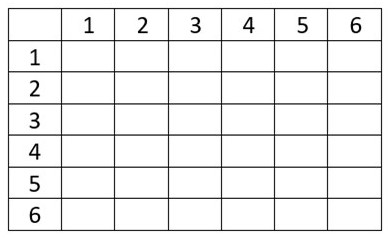
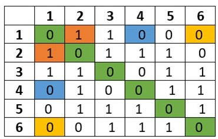
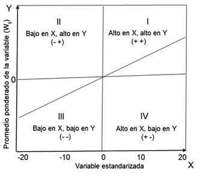

# Análisis espacial I: autocorrelación

## Autocorrelación y dependencia espacial
<div style="text-align: justify">
La identificación de autocorrelación espacial es importante como parte del proceso de análisis del fenómeno socioterritoriales al menos por dos cuestiones, una de carácter técnico y otra de carácter sustantivo. Respecto a los elementos técnicos es posible sostener que, si existe autocorrelación espacial en nuestros datos, lo más probable es que los métodos de estimación de los parámetros del modelo propuesto a través de mínimos cuadrados ordinarios dejen de ser válidos, en la medida en que no se cumplen los supuestos que requiere dicho procedimiento, específicamente, que los errores o perturbaciones del modelo no estén correlacionados. Por otro lado, cuando nos referimos a elementos sustantivos estamos queriendo expresar que nuestro fenómeno de interés, aquél que buscamos captar a través del modelo propuesto, en realidad estaría dejando de lado un comportamiento sistemático de asociación a nivel territorial.

Sobre este segundo punto detengámonos un momento. ¿Qué puede estar ocurriendo que hace que los fenómenos se no se distribuyan aleatoriamente en el espacio? Por ejemplo, ¿por qué se concentra la actividad económica en determinadas ciudades o por qué algunos servicios sólo se brindan en una zona de la ciudad? Esto respecto a fenómenos económicos, pero ¿qué hay con el hecho de que una enfermedad se concentra notoriamente en algunas áreas de la ciudad y no en otras? Dicho en otras palabras, ¿qué hay detrás de la formación de un patrón en la forma en que se distribuye un fenómeno en el espacio y cómo puede ser explicado? A eso nos referimos cuando decimos que hay elementos sustantivos para el análisis al hallar evidencia de autocorrelación espacial.

Un clásico ejemplo de lo provechoso que es el análisis espacial que indaga sobre patrones de relación espacial sustantivos es el caso de estudio de [John Snow](https://es.wikipedia.org/wiki/John_Snow) que en 1854 investigó las muertes por cólera en el barrio de Soho, en Londres. En esos años no se sabía con exactitud el mecanismo de transmisión del cólera, se creía que éste se adquiría por la ingesta de agua o alimentos contaminados (tal y cómo después se verificó gracias a los trabajos de Snow) o por respirar aire contaminado. En el material preparado por el *Center for Spatial Data Science* de la Universidad de Chicago, podrás encontrar el modo en que el análisis espacial puede ayudar a plantear y resolver las preguntas adecuadas: [Asking the right questions in spatial anaysis: the case of John Snow](https://uploads.knightlab.com/storymapjs/a0d512bc2bc17977f1029fedead0329a/trying-out/index.html).

Una definición sintética de autocorrelación espacial es la que nos brinda Chasco (2003) como “la relación funcional existente entre los valores que adopta un indicador en una zona del espacio y en zonas vecinas” [@Chasco2003,p. 49]. 

La definición se integra por tres elementos clave: i) valor de un indicador, ii) relación funcional y iii) zonas vecinas. Para dar sentido a nuestra definición pensemos en una afirmación como "los casos positivos de COVID19 en la alcaldía Azcapotzalco están asociados en forma directa con los casos positivos de COVID19 en las alcaldías y municipios vecinos que integran la Zona Metropolitana del Valle de México". Tendríamos entonces que:  

i) Indicador: casos positivos por COVID19.  
ii) Relación funcional: asociación positiva o directa.  
iii) Zonas vecinas: alcaldías y municipios vecinos de Azcapotzalco.  

El primer elemento no presenta demasiadas dificultades ya que en la base de datos que hemos estado utilizando tenemos los casos positivos por COVID19 por cada 1 mil habitantes; en tanto, el segundo elemento de nuestra afirmación es una mera suposición, es decir, que hay una relación positiva; por su parte, el tercer elemento "alcaldías y municipios vecinos" implica un problema: ¿de qué modo es posible establecer que alcaldías son o no vecinas de Azcapotzalco?  

Hay múltiples maneras que definir si un objeto espacial tiene o no vecinos, por ejemplo, podríamos decir que aquellas alcaldías que compartan límites administrativos con la demarcación territorial de nuestro interés serán sus vecinos (vecindad por adyacencia) o también sería posible establecer que las alcaldías vecinas serán aquellas que estén a menos de 10 km de distancia del centro económico de la alcaldía (vecindad por umbral de distancia).

------------------------------------------------------------------------

**Ejercicio**
 
i. ¿Se te ocurre algún otro criterio para establecer vecindad?

ii. ¿Cómo llamarías a un criterio de vecindad donde elijas a los 3 vecinos más cercanos?  

iii. ¿A partir de qué punto será más conveniente medir la distancia, desde el centro económico de la alcaldía o municipio (por ejemplo su zona industrial o comercial) o desde la sede de la administración local?  

iv. ¿La distancia más indicada usada como criterio de vecindad será una distancia lineal o una distancia por carretera?
 
------------------------------------------------------------------------

Los interesados en el análisis espacial han propuesto un ingenioso instrumento matemático para captar y sintetizar cómo un objeto se relaciona con otros en el espacio, es decir, para captar la *estructura espacial* del área de interés. Piensa en un vecindario o área de estudio compuesto sólo por seis elementos, tal como se ilustra en la figura 3.1:


```{r, echo=FALSE, fig.align='center',out.width='100%',fig.cap='Vecindario regular'} 
knitr::include_graphics("recursos 3/Vecindario regular.jpg")
```

A partir de la disposición de este hipotético vecindario nos interesa construir un instrumento para captar su estructura espacial a través de un criterio de adyacencia o contigüidad. A decir de Anselin (2020) "contigüidad significa que dos unidades espaciales comparten un borde común de longitud distinta de cero. Desde el punto de vista operativo, podemos distinguir aún más entre un criterio de contigüidad de tipo torre y de tipo reina, en analogía con los movimientos permitidos para las piezas así nombradas en un tablero de ajedrez. El criterio de la torre define a los vecinos por la existencia de un borde común entre dos unidades espaciales. El criterio de la reina es algo más amplio y define a los vecinos como unidades espaciales que comparten un borde o un vértice comunes" @Anselin2020.  

Ahora bien, ¿cómo podemos plasmar las relaciones de contigüidad de forma sintética. Pensemos en un cuadro que tiene tantas filas y columnas como objetos espaciales tiene nuestro vecindario, semejante al que aparece en la figura 3.2.

```{r, echo=FALSE, fig.align='center',out.width='100%',fig.cap='Matriz ejemplo vacía'} 

```

Coloquemos el número uno si el elemento 1 y el 2 comparten un lado, en caso contrario, coloquemos un cero. Hagamos esto para cada celda de este cuadro hasta que lo llenemos y obtengamos algo parecido a lo que aparece en la figura 3.3.

```{r, echo=FALSE, fig.align='center',out.width='100%',fig.cap='Matriz ejemplo llena'} 

```

El cuadro que acabamos de llenar es conocido como *matriz de pesos espaciales*[^3]. Habrá, por tanto, diversos tipos de matrices en función del criterio de vecindad elegido y del propio fenómeno analizado. No obstante, la más usual es una matriz de contigüidad binaria de $n$ x $n$, donde $n$ es el número de objetos espaciales.  

Este tipo de matriz, denotado por la letra mayúscula $W$, contiene como elementos $w_{ij}$ : el número 1 cuando el elemento $j$ y el elemento $i$ sean vecinos, o bien, 0 (cero) en cualquier otro caso. Este instrumento es uno de los más importantes en econometría espacial ya que permite construir los estadísticos de autocorrelación espacial y es la manera en que podemos incorporar al espacio como variable a partir de lo que denominamos “rezago espacial”. De la imagen anterior es posible apuntar algunas de las características de esta matriz:
  
* Es una matriz que en la diagonal principal contiene sólo ceros, es decir, se asume que por definición no hay interacción espacial dentro de un mismo elemento (lo que no necesariamente es cierto y que dependerá de la dimensión espacial de análisis).  
* Es una matriz simétrica, es decir, se asume que hay interacción de “ida y vuelta”, por lo que con un instrumento de estas características no es posible asumir efectos de interacción en un solo sentido.  

Aquí acabamos de ilustrar la lógica con la que puede ser construida una matriz de pesos espaciales a partir de una retícula regular con apenas seis elementos. Veamos ahora cómo obtener matrices de pesos espaciales sirviéndonos de R, ya que desarrollar los pasos anteriores para un vecindario compuesto por 76 elementos como los que integran el Valle de México es tarea para una máquina, no para nosotros.

## Matrices de pesos espaciales en R

### Los paquetes
<div style="text-align: justify">
En R hay muchas rutas para desarrollar la misma tarea. Lo que presentamos en este capítulo es una de múltiples maneras que pueden encontrarse para la construcción de matrices de pesos espaciales en R. En el apéndice, encontrarás otra alternativa, un tanto más elaborada. La manera en que desarrollamos en esta sección la tarea de construir las matrices de pesos espaciales se sirve de los siguientes paquetes:

* `rgdal`: según se lee en la documentación, "proporciona enlaces a la biblioteca de abstracción de datos 'geoespaciales'"
* `spdep`: contiene todo un arsenal de funciones para el análisis espacial, que permiten crear matrices de pesos espaciales, así como evaluar autocorrelación espacial. 

Como es usual, se deben descargar e instalar los paquetes:

```{r, eval = FALSE}
install.packages(c("rgdal","spdep"))
```

Para cargarlos:

```{r message=FALSE, warning=FALSE}
library(spdep)
library(rgdal)
```

### Matrices de contigüidad: el argumento `queen` de la función `poly2nb()`
<div style="text-align: justify">
Primero, carguemos la base de datos espacial. En este caso, recurrimos a la función `readOGR` que forma parte del paquete `rgdal` para leer los archivos de tipo SHP.

```{r}
covid_zmvm <-rgdal::readOGR("base de datos\\covid_zmvm shp\\covid_zmvm.shp")
```

Observa el objeto en tu ambiente de trabajo. Notaras que es un objeto de tipo *Spatial polygons data frame* y al hacer clic en la imagen de la lente de aumento no se desplegará la base de datos como es usual, sino que estará almacenada y agrupada de otra manera:  

* *data*: aquí están almacenados los datos de nuestro archivo .dbf.    
* *polygons*: la geometría del área estudiada se almacena aquí y se identifica a cada polígono (municipio o alcaldía) con un número del 1 al 76.    
* proj4string: recoge la información relativa al tipo de proyección cartográfica usada en nuestra base.   

Cuando en la computadora queremos definir una estructura espacial lo hacemos con un tipo de objeto que denominamos lista y no con matrices, es decir, el objeto con el que interactuaremos en R no será uno de tipo `matrix`, sino una especie de lista. El hecho de que se usen listas y no matrices para el proceso de cómputo es porque resulta más conveniente en términos de la cantidad ocupada de recursos del sistema puesto que las matrices, como las comentadas en la sección anterior, son *matrices dispersas*, es decir, contienen muchos elementos que son cero.

La función `poly2nb()` del paquete `spdep` nos permite calcular dos tipos de vecindad por adyacencia a través del argumento lógico `queen`. En la documentación de la función podemos leer que: “si es VERDADERO, `TRUE`, un solo punto límite compartido cumple la condición de contigüidad; si es FALSO, `FALSE`, se requiere más de un punto compartido; ten en cuenta que más de un punto límite compartido no significa necesariamente una línea límite compartida".  

Lo dicho en el párrafo anterior es relevante en el sentido de que los estos criterios, los usados por R en la construcción de matrices, no son exactamente los mismos que definimos antes (contigüidad reina y torre). Aquí la diferencia entre asignar como verdadero o falso el argumento `queen=`, puede ser interpretado como un criterio menos estricto o más estricto, respectivamente.

Vamos a construir un objeto que llamaremos `mTRUE`, dicho objeto contendrá los elementos que definen la vecindad: 

```{r}
mTRUE <- spdep::poly2nb(covid_zmvm)
```

El segmento de código anterior genera un objeto de tipo `nb`. Verifica sus características con `class()` y `str()` . Además, nota que en la sección de ambiente de trabajo (cuadrante superior derecho, en la pestaña ambiente) aparece el objeto creado. Da clic en la imagen de la lupa para visualizarlo e intenta interpretar el resultado de la ventana.

Ahora, llama a el objeto y presta atención sobre los resultados que ofrece:

```{r}
mTRUE
```

En la consola aparecen los siguientes elementos:

_Objeto de lista de vecinos:_  

* Número de regiones: 76. Corresponde al número de alcaldías y municipios que componen la Zona Metropolitana del Valle de México.  
* Número de enlaces distintos de cero: 380. Es el número de elementos de una matriz de 76x76 diferentes de cero.  
* Porcentaje de pesos distintos de cero: 6.57. Resultado de dividir 380 entre (76x76).  
* Número promedio de vecinos o vínculos: 5. Número de vecinos que en promedio tiene cada municipio o alcaldía.  

Ahora bien, para construir una lista de vecindad con base en un criterio más estricto, es decir, `queen = FALSE`, procedemos como:

```{r}
mFALSE<- spdep::poly2nb(covid_zmvm, queen = FALSE)
```

Ahora, llama dicho objeto y contrasta con los resultados anteriores.

```{r}
mFALSE
```

------------------------------------------------------------------------

**Ejercicio**
 
i. ¿Qué objeto, `mTRUE` o `mFALSE`, tiene el mayor número de vínculos diferentes de cero?

ii. ¿Por qué crees que esto es así?

------------------------------------------------------------------------

Es posible observar que, con base en este segundo criterio de vecindad, se identificaron un menor número de vecinos (número de vínculos diferente de cero). 

Estas listas, que contienen nuestras estructuras espaciales en los objeto de tipo `nb` llamados `mTRUE` y `mFALSE`, pueden representarse visualmente a través de un *gráfico de conectividad* que representa la estructura espacial definida por cada criterio a través de líneas que unen a los municipios considerados vecinos.  

Para visualizar el mapa de conectividad recurrimos a la función `plot()` y superpondremos dos gráficas: una sólo con los bordes o límites a nivel municipal y otra con los centroides y la estructura espacial. Aquí se muestra el mapa de conectividad resultado de la matriz `mTRUE`

```{r}
plot(covid_zmvm, border = 'lightgrey')
plot(mTRUE, coordinates(covid_zmvm), add=TRUE, col='lightblue')
```

Para comparar ambas formas podemos superponer las dos gráficas y asignar colores diferentes:

```{r}
plot(covid_zmvm, border = 'lightgrey')
plot(mTRUE, coordinates(covid_zmvm), add=TRUE, col='blue')
plot(mFALSE, coordinates(covid_zmvm), add=TRUE, col='lightgreen')
```

Como puedes observar, son estructuras muy parecidas, aunque es posible notar sus diferencias. Es ampliamente recomendable que revises el apéndice de este capítulo pues en él se trata un enfoque diferente para la construcción de matrices de pesos espaciales que, si bien es más complejo, te puede servir para avanzar en tu conocimiento sobre R.

## Estadísticos de correlación espacial

### La matriz de pesos espaciales estandarizada
<div style="text-align: justify">
Antes dijimos que cada uno de los elementos $w_{ij}$  de la matriz $W$ pueden tomar como valores ceros o unos. La matriz $W$ puede escribirse como:


$$
W=
\begin{pmatrix}
w_{11} & w_{12} & \cdots  & w_{1n}\\
w_{21} & w_{22} & \cdots  & w_{2n}\\
\vdots & \vdots & \ddots  & \vdots \\
w_{n1} & w_{n2} & \dots  & w_{nn}\\
\end{pmatrix}
$$

No obstante, es posible expresar dicha matriz $W$ de una forma diferente, normalizandola por filas. Normalizar una matriz de pesos espaciales por filas implica dividir cada elemento $w_{ij}$ de una fila entre la suma de elementos diferentes a cero de dicha fila, es decir:

$$w_{ij(s)}=\frac {w_{ij}} {\sum{w_{ij}}}$$
La matriz de pesos espaciales estandarizada es la que usaremos en lo sucesivo para construir lo que denominaremos rezago espacial y para la construcción de estadísticos de correlación espacial, un poco más adelante. El proceso de estandarización de las matrices que recién creamos, los objetos `mTRUE` y `mFALSE`, corre a cuenta de la función `nb2listw()` del paquete `spdep`:
  
```{r}
mTRUE.pesos <- spdep::nb2listw(mTRUE)
mTRUE.pesos

mFALSE.pesos <- spdep::nb2listw(mFALSE)
mFALSE.pesos
```


Notaras cómo en el ambiente de trabajo se ha creado un objeto nuevo de tipo `listw`. Ábrelo y observa su contenido.

------------------------------------------------------------------------

**Ejercicio**
 
i. ¿Logras comprender por qué se le denomina matriz (lista) estandarizada?

ii. ¿Logras identificar cómo la suma de cada renglón de la lista es igual a uno? ¿Cómo se relaciona la forma en que aparecen enlistados los elementos con el número de vecinos que tiene cada objeto espacial?

------------------------------------------------------------------------

### El rezago o retardo espacial
<div style="text-align: justify">
Regresemos a nuestra definición sobre la autocorrelación espacial: relación funcional existente entre los valores que adopta un indicador en una zona del espacio y en zonas vecinas. Ya hemos visto cómo podemos operacionalizar el concepto de vecindad, por lo que podemos ahora concentrémonos en los otros elementos. Comencemos con aquel que define el valor de una variable en las zonas vecinas, a lo que llamaremos *variable espacialmente rezagada*. Una variable espacialmente rezagada no es otra cosa que un promedio ponderado del valor de una variable en un sitio y sus locaciones vecinas [@Chasco2003,p. 61; @Anselin2020]. Siguiendo a [@Anselin2020], "el rezago espacial de $y$ del objeto espacial $i$ es expresado como $Wy_{i}$:

$$
\begin{aligned}
Wy_i &=  w_{i1}y_1+w_{i2}y_2+...+w_{in}y_n \\
Wy_i &=  \sum_{j=1}^nw_{ij}y_j \\
\end{aligned}
$$

Recuerda que $w_{ij}$ no es otra cosa que cada uno de los elementos de la matriz de pesos estandarizada por fila y que define la estructura de asociación en el espacio.  

Construiremos un rezago espacial de la variable `pos_hab` con ayuda de la función `lag.listw()` del paquete `spdep`. Indicamos dos argumentos en la función: la estructura espacial dada por la matriz estandarizada, `mTRUE.pesos`, y la variable de la que deseamos el rezago espacial, `pos_hab`, esto es guardado en un nuevo objeto, `lag_poshab`, tal y como se muestra en el siguiente segmento de código:

```{r}
lag_poshab <- lag.listw(mTRUE.pesos, covid_zmvm$pos_hab)
```

Para lograr apreciar mejor nuestro rezago espacial, construiremos una tabla de dos columnas que almacenaremos en el objeto `df`, la primera contendrá la variable original y la segunda el rezago espacial, luego pediremos que nos muestre los primeros registros de la tabla con la función `head()` en un formato estilizado a través de la función `kable()` del paquete `knitr`:

```{r warning=FALSE}
#Crea un nuevo arreglo de datos donde se almacena la variable original y el rezago espacial
df <- data.frame(pos_hab = covid_zmvm$pos_hab, lag_poshab)

library(knitr)

#Coloca los primeros valores de ambas variables en una tabla, requiere instalación y carga del paquete  knitr
kable(head(df))
```

El valor de la segunda columna, `lag_poshab`, es el promedio ponderado de los casos positivos de los vecinos de cada uno de los 76 municipios y alcaldías de nuestra base. Para inspeccionar esto, observemos tanto a los vecinos de una unidad espacial como a sus respectivos valores de `pos_hab`.  

Para identificar a los vecinos de cada observación hay que extraer el dato utilizando dobles corchetes desde el objeto que contiene la estructura espacial no ponderada, `mTRUE`. Para nuestra observación identificada con el número 1 tenemos:

```{r}
#Devuelve el nombre del municipio identificado con el número 1
covid_zmvm$nom_mun[[1]]

#Devuelve los números de identificación de los municipios y alcaldías vecinas del Álvaro Obregón, la observación identificada con el número 1.
mTRUE[[1]]
```

------------------------------------------------------------------------

**Ejercicio**
 
i. ¿Cómo interpretas el resultado anterior?  

ii. ¿Qué son los números que se desplegaron?  

------------------------------------------------------------------------

Ahora bien, ¿cuál es el valor de los casos positivos por cada 100 mil habitantes para cada una de las observaciones recién obtenidas? Para llamarlas a la consola podemos escribir:

```{r}
#Devuelve el nombre de las alcaldías y municipios vecinos de Álvaro Obregón
covid_zmvm$nom_mun[mTRUE[[1]]]

#Devuelve el valor de pos_hab para cada observación vecina de Álvaro Obregón
covid_zmvm$pos_hab[mTRUE[[1]]]
```

Los valores previamente listados corresponden tanto al nombre como al número de casos positivos de los vecinos de Álvaro Obregón. Así, el primer valor de la tabla es el resultado de (16.98 + 14.94 + 18.70 +13.67 + 20.55 + 11.08)/6, es decir, 15.99.


### Coeficiente de correlación espacial: la I de Moran
<div style="text-align: justify">
Sin duda, el estadístico de asociación espacial más común es la I de Moran, que no es otra cosa que un coeficiente de correlación lineal que "incorpora al espacio", es decir, mide la asociación lineal entre la variable de interés y su rezago espacial.

Para calcular el coeficiente o estadístico de Moran necesitamos recurrir a la función `moran.test()` del paquete `spdep`. Los argumentos de la función deben especificar el nombre de la variable y el tipo de estructura espacial dado por la matriz de pesos usada; adicionalmente, se puede indicar qué hacer en caso de que existan islas (objetos espaciales sin vecinos) con el argumento `zero.policy`.

------------------------------------------------------------------------

**Ejercicio**
 
i. ¿Para qué sirve el argumento `randomization` de la función `moran.test()`?  

ii. ¿De qué modo es posible cambiar la hipótesis alternativa de la evaluación de autocorrelación espacial en la prueba de Moran?  

------------------------------------------------------------------------

Construyamos el estadístico de Moran para la variable `pos_hab` usando la estructura espacial llamada `mTRUE.pesos`:
  
```{r}
spdep::moran.test(covid_zmvm$pos_hab, mTRUE.pesos)
```

Del indicador obtenido nos interesan tres elementos, como es usual: la magnitud del coeficiente, su sentido y su significancia estadística. En los resultados que aparecen en tu consola identifica cada uno de ellos:


------------------------------------------------------------------------

**Ejercicio**
 
1. ¿A cuánto asciende el coeficiente estimado? ¿Podría decirse que es alto o bajo?

2. ¿La relación identificada es positiva o negativa?  

------------------------------------------------------------------------

Un coeficiente como el obtenido, de 0.657, indica que hay una relación positiva entre los valores de los casos positivos de COVID19 y los valores de los casos positivos por COVID19 en los entornos vecinos, además, podríamos decir que es relativamente alto en la medida en que el coeficiente puede tomar valores entre -1 y 1 y el que hemos obtenido está más cercano a 1. ¿Qué hay con su significancia estadística? ¿cómo podemos saber que dicho resultado no es producto del azar? Para evaluar su significancia estadística hay que observar el _p-value_, y evaluemos su significancia estadística a través del siguiente juego de hipótesis:
  
- $Ho:$ distribución espacial aleatoria  
- $Ha:$ distribución espacial no aleatoria  

Con la información disponible y fijando un nivel de significancia, $\alpha$, en 0.05 se rechaza la hipótesis nula en favor de la hipótesis alternativa, por tanto, la variable no se distribuye de forma aleatoria en el espacio, sino que muestra indicios de asociación espacial positiva y relativamente alta (0.657).

------------------------------------------------------------------------

**Ejercicio**
 
Construya una I de Moran con la estructura espacial dada por la matriz donde `queen=FALSE` responda:

i. ¿La asociación espacial es positiva o negativa?

ii. ¿Consideras que es alta o baja?

iii. ¿Dirías que dicha relación es producto del azar o que existe un comportamiento sistemático?

------------------------------------------------------------------------


### Diagrama de dispersión de Moran
<div style="text-align: justify">
Una forma creativa de expresar gráficamente la autocorrelación de la variable de interés es a través de un diagrama de dispersión cuyo eje $x$ corresponde a la variable de interés, casos positivos de COVID19 por cada 1 mil habitantes, y en el eje $y$ su rezago espacial; además, al agregar una recta de ajuste sobre los datos estandarizados lograremos que la pendiente de dicha recta corresponda exactamente al valor de la I de Moran. Una de las características del diagrama de Moran es que se descompone en cuatro cuadrantes, tal como aparece en la figura 3.4.

```{r, echo=FALSE, fig.align='center',out.width='100%',fig.cap='Diagrama de dispersión de Moran'} 

```

Para representar el diagrama de dispersión de Moran o simplemente diagrama de Moran recurrimos a la función `moran.plot()` del paquete `spdep` que para una matriz de tipo reina con el argumento `queen=TRUE`:
  
```{r}
spdep::moran.plot(((covid_zmvm$pos_hab)-mean(covid_zmvm$pos_hab))/(sd(covid_zmvm$pos_hab)),
                  listw = mTRUE.pesos, 
                  xlab="Casos positivos",
                  ylab="Rezago espacial de los casos positivos",
                  main="Diagrama de Moran para casos positivos",
                  col="lightblue")
```

Múltiples elementos de personalización de ésta y otras gráficas asociadas al paquete base de R pueden revisarse en la documentación de la función `par()`. 
------------------------------------------------------------------------

**Ejercicio**
 
¿Es posible construir un diagrama de Moran usando el paquete ggplot2? De ser así, ¿cómo lo harías de ser así?

------------------------------------------------------------------------

## Índice de Moran local y mapa de clusters
<div style="text-align: justify">
El índice de Moran que recién hemos descrito permite evaluar la existencia de un patrón espacial completo, por lo que no proporciona información de la ubicación de las agrupaciones, es decir, es una medida de autocorrelación espacial global. Para subsanar esta situación, [@Anselin1995] propuso la versión local de la I de Moran: LISA (local indicator of spatial association).

Este indicador:  

* Proporciona un estadístico para cada ubicación con un nivel de significancia.  
* Establece una relación proporcional entre el estadístico local y el global.  

La representación del LISA en un mapa, conocido como  **mapa de Cluster** (que permite clasificar las áreas significativas según el tipo de asociación identificada)  en compañía con un mapa que indique la significancia estadística de cada valor (muestra las ubicaciones con la I de Moran local que son representativas en diferentes niveles de $\alpha$) permite la clasificación de las áreas estadísticamente significativas en clusters o agrupamientos (alto-alto y bajo-bajo) y de áreas que se constituyen como observaciones espaciales atípicas o *spatial outliers* (agrupamientos bajo-alto y alto-bajo).  

El Índice local de Moran toma la forma de:
  
$I_i = \frac{(x_i-\bar{x})}{{∑_{k=1}^{n}(x_k-\bar{x})^2}/(n-1)}{∑_{j=1}^{n}w_{ij}(x_j-\bar{x})}$
  
  
Para calcular un índice de Moran local en R usamos la función `localmoran()`. Creamos un objeto denominado `local` que echa mano de la matriz `mTRUE.pesos`:
  
```{r}
local <- spdep::localmoran(covid_zmvm$pos_hab, mTRUE.pesos)
```

El objeto creado, `local` es de tipo "localmoran", no es otra cosa que una tabla que contiene múltiples variables cuyo contenido corresponde, según indica la propia ayuda de la función, a:
  
* Ii: estadístico de Moran local.  
* E.Ii: valor esperado del estadístico de Moran local.  
* Var.Ii: varianza del estadístico local de Moran.  
* Z.Ii: desviación estándar del estadístico de Moran local.  
* Pr (): valor p del estadístico de Moran local.  

Nos interesa la primera columna, `Ii`, el índice de Moran local  y la columna `Pr` que contiene la probabilidad asociada, por lo que uniremos los resultados del objeto `local` a la tabla original que contiene nuestra base de datos. Para eso hay que usar la función `cbind()` (combinar por columna) en un nuevo objeto que llamaremos `mapa.moran`:
  
```{r}
mapa.moran <- base::cbind(covid_zmvm, local)
```

Primero, llevemos los resultados del Moran Local a un mapa de quintiles aplicando las funciones aprendidas en `tmap`:
  
```{r}
tmap::tm_shape(mapa.moran) +
  tmap::tm_fill(col = "Ii", style = "quantile",
                palette = "Spectral", midpoint= NA,
                title = "I de Moran local") +
  tmap::tm_borders()
```

El mapa permite observar la manera en que varía la correlación espacial a nivel local. Pero necesitamos otro instrumento que nos permita identificar si los valores de la I de Moran local son o no significativos en esas áreas y de esta manera identificar agrupaciones o núcleos de cluster significativos, así como observaciones espaciales atípicas, es decir, un mapa de significancia. Esto lo hacemos siguiendo la propuesta de [@Lovelace2014]:

```{r}
# crea un vector numérico de la misma longitud del tamaño de filas de la base "local"
cuadrantes <- vector(mode="numeric",length=nrow(local))

# Centra la variable de interés (CRIME) alrededor de su media
m.COVID <- covid_zmvm$pos_hab - mean(covid_zmvm$pos_hab)

# Centra el Índice de Moran local alrededor de su media (columna 1 de la base "local")
m.local <- local[,1] - mean(local[,1])    

# Fija el umbral de significancia
signif <- 0.05 

# Identificación de los cuadrantes de interés
cuadrantes[m.COVID >0 & m.local>0] <- 4  
cuadrantes[m.COVID <0 & m.local<0] <- 1      
cuadrantes[m.COVID <0 & m.local>0] <- 2
cuadrantes[m.COVID >0 & m.local<0] <- 3
cuadrantes[local[,5]>signif] <- 0   

#Para graficarlo
cortes <- c(0,1,2,3,4)
colores <- c("white","blue",rgb(0,0,1,alpha=0.4),rgb(1,0,0,alpha=0.4),"red")
plot(mapa.moran, border="lightgray",col=colores[findInterval(cuadrantes,cortes,all.inside=FALSE)])
box()
legend("bottomleft",legend=c("No signficativo","Bajo-Bajo","Bajo-alto","Alto-Bbajo","Alto-Alto"),
       fill=colores,bty="n")
```

El mapa anterior permite identificar agrupamientos de valores significativos al 10%, núcleos de cluster que muestran municipios y alcaldías con valores altos de tasas positivas de COVID19 rodeados de vecinos con valores altos (agrupamiento Alto-Alto), así como agrupamientos de valores bajos (cuadrante Bajo-Bajo), además de observaciones espaciales atípicas (cuadrante Alto-bajo).

En síntesis, hasta este punto hemos visto en este capítulo:

i) Cómo definir estructuras de relación espacial a través de dos criterios,  
ii) Cómo identificar autocorrelación espacial global a través de la I de Moran,
iii) Cómo evaluar la significancia estadística de la I de Moran,  
iv) Cómo identificar agrupaciones locales a través del indicador LISA.  

En el capítulo 5 nos adentraremos en cómo incorporar la riqueza que proporciona el análisis espacial en un modelo econométrico. Mientras tanto, en el capítulo 4 llevaremos a cabo un repaso de elementos básicos sobre los modelos de regresión lineal clásica con mínimos cuadrados ordinarios.


## Apéndice: Un enfoque adicional para construir matrices de pesos espaciales
<div style="text-align: justify">
Aquí presentamos el enfoque utilizado por el *Center for Spatial Data Science* de la Universidad de Chicago para la definición de estructuras espaciales. Es una ruta más compleja que la descrita en las secciones previas y, por tanto sino más rica pues permite definir matrices de adyacencia con criterios específicos (torre y reina), así como matrices de umbrales de distancia (k-vecinos más cercanos), tal como se hace en GeoDa. Los paquetes utilizados son:  
  
* `sf`: paquete para el "soporte de funciones simples, una forma estandarizada de codificar datos vectoriales espaciales", es decir, permite que R lea el tipo de datos que vamos a usar aquí, datos en formato SHP.  
* `spdep`: el mismo que describimos en el enfoque anterior.
* `purrr`: es un paquete que potencia las funciones de programación funcional de R, implica cierto conocimiento de cómo automatizar algunas tareas en esta plataforma.  
* `ggplot2`: el popular paquete para hacer bellas gráficas.    
* `knitr`:  permite generar reportes estilizados en R.  

Si aún no los has instalado, hazlo. Si ya los instaste, llámalos al entorno de trabajo:

```{r message=FALSE}
library(sf)
library(spdep)
library(purrr)
library(ggplot2)
library(knitr)
```

Para construir las matrices de pesos espaciales con este segundo enfoque, es necesario cargar de nueva cuenta la base de datos, pero ahora a través de la función `st_read()` del paquete `sf`. Para ello, recurrimos a: 
  
```{r}
covid_zmvm_sf <-sf::st_read("base de datos\\covid_zmvm shp\\covid_zmvm.shp")
```

Note el tipo de objeto creado (sf) al cargar la base con esta función que difiere del tipo de objeto usado en el primer método (spatial polygon dataframe).

### Matriz tipo torre (*rook*)
<div style="text-align: justify">
La construcción de las matrices de pesos espaciales en R con este segundo enfoque se hará a través de los paquetes `sf` y `spdep`, que permitirá crear una matriz de tipo torre y reina.

Para hacerlo, es necesario seguir dos pasos. En el primero se construirá una función que recoja la relación de vecindad, a esta función la llamaremos `func_torre` y dentro de dicha función definiremos la relación de vecindad que nos interesa a través de otra función, la función `st_relate()` del paquete `sf` que "calcula relaciones entre pares de geometrías o las empareja con un patrón dado. Esta función también tiene un parámetro para un patrón específico" [@AnselinMorrison2018] y la que nos interesa es el patrón "compartir lados". Posteriormente, en el segundo paso, aplicamos la función creada a nuestra geometría para crear un objeto de tipo `sgbp`:
  
  
```{r}
func_torre = function(a, b = a) st_relate(a, b, pattern = "F***1****")#Define la función y sus parámetros
torre.sgbp <- func_torre(covid_zmvm_sf) # Crea un objeto a partir de la función anterior. Requiere tener cargado el paquete sf
```

Observa la estructura y clase que tiene el objeto recién creado, `torre.sgbp`: es un objeto de tipo `sgbp`. Para poder interactuar más adelante con este objeto, es necesario modificar su clase. Se trata, pues, de transformar el objeto a una clase `nb`, es decir, una *neighbor list* (lista de vecinos). Llevaremos a cabo este procedimiento creando una función para el caso, `as.nb.sgbp`. Esta función nos permitirá además lidiar con los polígonos que no tienen vecinos. 

```{r}
as.nb.sgbp <- function(x, ...) {#Define la función con 1 argumento, un objeto de tipo `sgbp`
  attrs <- attributes(x) #Guarda los atributos del objeto de tipo sgbp
  x <- lapply(x, function(i) { if(length(i) == 0L) 0L else i } ) #Función que coloca un 0 a cada elemento sin vecinos.
  attributes(x) <- attrs #aplica los atributos recién modificados al argumento x.
  class(x) <- "nb" # Cambia el tipo de objeto de `sgbp` a `nb`
  x #Devuelve el objeto
}
```

Ahora, a través de la función recién creada trasformaremos el objeto `torre.sgbp` a un objeto de clase `nb`. 

```{r}
torre.nb <- as.nb.sgbp(torre.sgbp)
summary(torre.nb)
class(torre.nb)
length(torre.nb)
```

Finalmente, construimos la matriz (lista) ponderada a través de la función `nb2listw()`, verifique por su cuenta la estructura del objeto creado:
  
```{r}
torre.pesos <- spdep::nb2listw(torre.nb, zero.policy = TRUE)
```


### Matriz tipo reyna (*queen*)
<div style="text-align: justify">
Procedemos de forma semejante para la construcción de una matriz tipo torre, a través de un par de funciones. Primero, se establece la función que recoge los patrones de interés, "compartir lados y vértices":
  
```{r}
func_reina <- function(a, b = a) st_relate(a, b, pattern = "F***T****")
```

Luego, con esta función, creamos un objeto de tipo `sgbp` que contendrá los elementos informativos de vecindad tipo reina:

```{r}
reina.sgbp <- func_reina(covid_zmvm_sf)
```

A continuación convertimos el objeto creado de `sgbp` a `nb` con la función elaborada en la secuencia de la matriz tipo torre:
  
```{r}
reina.nb <- as.nb.sgbp(reina.sgbp)
summary(reina.nb)
```

Es turno de la matriz ponderada:
  
```{r}
reina.pesos <- spdep::nb2listw(reina.nb, zero.policy = TRUE)
```


### Matrices de contigüidad de orden superior
<div style="text-align: justify">
Es posible contar con matrices de órdenes superiores, para ello, recurrimos a la función `nblag()` con la que creamos un objeto del que, en el segundo paso, extraeremos la información de interés. Nota que el orden de contigüidad está establecido en el segundo argumento:
  
```{r}
reina.2o <- spdep::nblag(reina.nb, 2)
```

Verifica la estructura con `str()`. A partir del objeto realizado, `reina.2o`, se creará otro de tipo `nb` que contendrá la información relativa a los datos de vecindad de tipo reina de orden 2, a través de una selección del segundo elemento de dicho objeto:
  
```{r}
reina.2o.nb <- reina.2o[[2]]
```

Para poder tener los dos tipos de estructura espacial (reina de primer y de segundo orden) en un solo objeto, es necesario crear un objeto a partir de la función `nblag_cumul()` que arrojará como resultado un elemento de tipo `nb`  que contendrá tanto la estructura de dependencia de primer como la de segundo orden:

```{r}
reina.ambos <- spdep::nblag_cumul(reina.2o)
```


## Visualización de la estructura espacial
<div style="text-align: justify">
La visualización de la estructura espacial en este segundo enfoque es un poco más complicada, pues para poder mostrarla en un mapa de conectividad es necesario contar con los centroides geométricos como objetos independientes, es decir, como un par de coordenadas en un objeto independiente.  Éstos los extraeremos del atributo "Geometry" que aparece en nuestra base de datos de tipo `sf` (`covid_zmvm_sf`). Para extraerlos usaremos la función `map_dbl()` del paquete `purrr` y `st_centroid()` del paquete `sf`, como se muestra enseguida:
  
```{r}
longitud <- purrr::map_dbl(covid_zmvm_sf$geometry, ~st_centroid(.x)[[1]])
latitud <- purrr::map_dbl(covid_zmvm_sf$geometry, ~st_centroid(.x)[[2]])
```

Ahora, esos elementos los guardamos en un nuevo objeto con la función "combina por columna", es decir, `cbind()` (*column bind*):
  
```{r}
coords <- cbind(longitud, latitud)
```

Para poder visualizar la estructura espacial de cada tipo de vecindad debemos graficar los centroides, la geometría de interés y las líneas que unen los centroides ,las cuales indican la vecindad. Para el caso de la matriz tipo torre:
  
```{r}
plot(torre.nb, coords, lwd=.2, col="blue", cex = .5)
```

Para el caso de la matriz de tipo reina de primer orden:
  
```{r}
plot(reina.nb, coords, lwd=.2, col="red", cex = .5)
```

Para la de segundo orden:
  
```{r}
plot(reina.2o.nb, coords, lwd=.2, col="blue", cex = .5)
```


## Matrices de distancia: k-vecinos más cercanos
<div style="text-align: justify">
En este segundo enfoque expuesto, el de Anselin y su equipo, es posible construir otro tipo de matrices a partir de umbrales de distancia: matriz de k-vecinos más cercanos. Para ello, usaremos de nueva cuenta las coordenadas con los centroides como punto de referencia para medir la distancia (el objeto `coords`). Luego, a través de dos funciones `knearneigh` y `knn2nb` del paquete `spdep` construiremos la matriz, transformándola enseguida en un objeto de tipo `nb`. Luego, la convertiremos propiamente en un objeto tipo lista con los pesos:
  
```{r}
k6nb <- knn2nb(knearneigh(coords, k = 6))
k6.pesos <- nb2listw(k6nb)
```

Para visualizar la estructura espacial:
  
```{r}
plot(k6nb, coords, lwd=.2, col="blue", cex = .5)
```

[^3]: "La estructura espacial suele expresarse formalmente a través de una matriz de interacciones espaciales, también llamada “matriz de pesos, ponderaciones, distancias o contactos espaciales” [@Chasco2003,p. 55]


