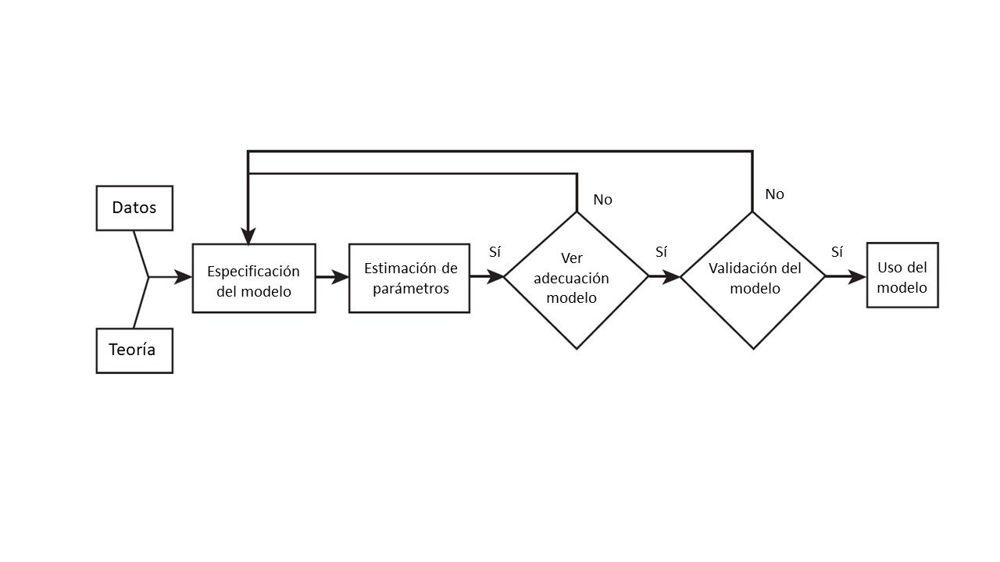

# Modelos de regresión lineal
<div style="text-align: justify">
Hasta este punto hemos hecho un recorrido que va desde los elementos más básicos sobre la exploración de información (capítulo 1), pasando por la representación de información espacial a través de mapas coropléticos (capítulo 2), hasta la exploración de patrones de asociación de una variable en el espacio, la llamada autocorrelación (capítulo 3).  

Antes de avanzar en el conocimiento de las herramientas que nos permitirán elaborar algunos modelos básicos que incorporen los patrones espaciales que hemos identificado a través de econometría espacial (capítulo 5), en este capítulo hacemos un pequeño paréntesis en el tratamiento de la información espacial para llevar a cabo un repaso elemental, desde una perspectiva práctica, del modelo clásico de regresión lineal. Esto nos permitirá que tengas en la mente dos cosas: i) qué es lo que se busca a través de modelos econométricos y ii) cuáles son los supuestos detrás del modelo clásico de regresión lineal estimado con el método de Mínimos Cuadrados Ordinarios (MCO). 

## Causalidad y correlación: el alcance del análisis de regresión

En el proceso de investigación podemos plantearnos preguntas con un grado de complejidad diverso. Habrá preguntas que, al ser respondidas, nos permitan tener una descripción general del fenómeno, habrá otras que nos permitan explorar la relación entre dos fenómenos, o bien, preguntas cuya respuesta nos permita predecir el comportamiento futuro del elemento estudiado. Así pues, hay [diferentes tipos de preguntas de investigación](https://bookdown.org/rdpeng/artofdatascience/types-of-questions.html), dependiendo de su grado de complejidad. En su libro "El arte de la ciencia de datos", Roger Peng y Elizabeth Matsui[-@PengMatzui2017], abordan sistemáticamente esta cuestión.   

Entre los tipos de preguntas planteadas se halla uno que es de particular interés: el análisis causal. El objetivo del análisis causal indagar si el cambio en una variable provoca el cambio en otra, es decir, interesa descubrir la relación de causa efecto entre ellas. Con el análisis causal se busca saber si un par de variables están asociadas, más aún, si el cambio en una variable causa cambios en la otra.  

Responder este tipo de preguntas exige el dominio de diversas herramientas estadísticas, cuyo abordaje está  fuera del alcance de este capítulo. No obstante, el análisis de regresión nos brinda una oportunidad que, cuando es bien utilizada, nos permite aproximarnos al análisis causal.

La regresión como instrumento analítico nos brinda elementos para acercarnos a la comprensión de la *asociación entre dos variables*, aunque no es posible hablar en sentido estricto descubrir relaciones de causalidad como resultado del análisis de regresión. Así, "El análisis de regresión solo puede abordar los problemas de correlación. No puede abordar el problema de la necesidad (causalidad). Por tanto, nuestras expectativas de descubrir relaciones de causa y efecto a partir de la regresión deberían ser modestas" [@Montgomery2012, p.3].

Entonces, ¿de qué modo el análisis de regresión se convierte potencialmente en un elemento que nos permite analizar causalidad? Lo que resultará fundamental en el proceso de investigación que recurre a esta herramienta es pues la pregunta que se plantee el investigador, preguntas que deben ser planteadas desde el conocimiento científico previamente existente. Dicho en otros términos, el análisis de causalidad que nos da la regresión, sí lo puede ofrecer la teoría existente en determinado campo de conocimiento: ¿qué dice la teoría sobre la relación entre la variable A y la variable B?

¿Qué asociaciones entre pares de variables recuerdas de tus cursos teoría económica? Quizá los siguientes ejemplos te resulten familiares: i) la asociación entre la tasa de interés y eficiencia marginal del capital en la teoría de la inversión de Keynes, ii) la relación entre la composición orgánica del capital y tasa de ganancia en la perspectiva de Marx sobre el comportamiento de largo plazo del capitalismo (la teoría de la tasa de ganancia decreciente), iii) los rendimientos decrecientes en el producto al añadir una unidad adicional de trabajo, *ceteris paribus*, en la teoría del productor de los neoclásicos.

En el proceso de investigación científica, las preguntas planteadas deberán hacerse desde el conocimiento previamente existente, es decir, se plantean desde determinados cuerpos teóricos reconocidos y validados, o bien, a partir de los resultados de investigaciones previas. Antes del método está la pregunta de investigación que establece la línea de causalidad entre las variables postuladas en el modelo. Esta base teórica ha de ser complementada con los resultados arrojados en el análisis exploratorio.  

Así pues, es relevante la siguiente advertencia:

"Para establecer la causalidad, la relación entre los regresores y la variable de respuesta debe tener una base fuera de los datos de la muestra; por ejemplo, la relación puede ser sugerida por consideraciones teóricas. El análisis de regresión puede ayudar a confirmar una relación de causa y efecto, pero no puede ser la única base de tal afirmación" [@Montgomery2012, p.3].

## Lo "artesanal" de la econometría
<div style="text-align: justify">
No cabe duda que la especificación de un buen modelo econométrico tiene algo de artesanal, es decir, serán pocas las ocasiones en las que no tendremos que proponer diferentes alternativas de modelo, probar con múltiples variables y llevar a cabo un sin número de ajustes. Conviene desde este momento eliminar la idea de que "solo hay que aplicar una técnica": todas las técnicas requieren práctica y el desarrollo de habilidad en su uso pues no siempre enfrentaremos un mismo problema en las mismas condiciones. A este respecto puede ser apuntado que:

"La construcción de un modelo de regresión es un proceso iterativo. Comienza utilizando conocimiento teórico del proceso que se está estudiando y los datos disponibles para especificar un modelo de regresión inicial. Las visualizaciones de datos gráficos suelen ser muy útiles para especificar el modelo inicial. Luego, los parámetros del modelo se estiman, normalmente por mínimos cuadrados (...). Luego debe evaluarse la adecuación del modelo. Consiste en buscar posibles errores de especificación de la formula del modelo, como no incluir variables importantes, o incluir variables innecesarias, o datos inusuales o inapropiados. Si el modelo es inadecuado, entonces debe proponerse nuevamente uno diferente y estimar nuevamente los parámetros. Este proceso puede repetirse varias veces hasta obtener un modelo adecuado. Finalmente, la validación del modelo debe llevarse a cabo para asegurar que el modelo producirá resultados que sean aceptables en la aplicación final" [@Montgomery2012, p.3-10].

La idea anterior aparece esquematizada en la figura 4.1, que es tomada de Montgomery et al. (2012: p. 10)y . 
```{r, echo=FALSE, fig.align='center',out.width='100%',fig.cap='Construcción de un modelo de regresión'} 

```

En este capítulo buscamos que recuerdes algunos de los elementos fundamentales del análisis de regresión, como sus supuestos básicos y la interpretación de los resultados que nos ofrece este instrumento. Para ilustrar dichos elementos nos serviremos de la [base de datos sobre COVID19](https://bit.ly/covid_zmvm) que contiene información sobre las condiciones sociodemodráficas y económicas de los municipios en la Zona Metropolitana del Valle de México, la misma base que hemos explorado en los capítulos previos. La pregunta que nos interesa responder es de carácter preliminar y no atiende a cuerpo teórico alguno, por lo que los resultados son solo ilustrativos y tienen solo fines didácticos. La pregunta planteada es:  ¿de qué manera se asocian las condiciones sociales, demográficas y económicas, tanto con los casos positivos de COVID19 por cada 1 mil habitantes, como con las muertes provocadas por este mal por cada 1 mil habitantes? Para lograr dar solución a la pregunta propondremos algunos modelos econométricos y buscaremos interpretarlos.

## Qué buscamos a través de una regresión (con mínimos cuadrados ordinarios)
<div style="text-align: justify">
Un modelo es una representación simplificada de la realidad. En el caso particular de un modelo econométrico y de la regresión lineal lo que se pretende *encontrar la recta que mejor se ajusta a los datos observados*. 
La técnica más usual para lograrlo son los llamados **mínimos cuadrados ordinarios**, MCO, justamente poque este método minimiza la suma de los *residuales* al cuadrado.  

Veamos esta idea de forma interactiva a través de una sencilla ilustración en R. Para ello, crearemos una función que tendrá un solo parámetro al cual llamaremos `beta` y que será el valor de la pendiente de una recta que buscaremos ajustar a un conjunto de datos. Lo que pretendemos pues es encontrar el mejor valor de `beta`, es decir, el valor que permita minimizar la distancia entre los puntos dados por los pares ordenados (variable $x$ y $y$) y la recta, en otras palabras, buscamos un valor de `beta` que minimice los errores.

Para usar la aplicación interactiva, debes instalar los siguientes paquetes:

```{r, eval = FALSE}
#Instalar dos paquetes
install.packages(c("manipulate", "UsingR"))
```

Ahora bien, antes de ejecutar los segmentos de código que aparecen más abajo, leélos e intenta comprender qué es lo que hace cada línea:  

- Se usa `function()` justamente para crear para crear una función que llevará por nombre `Gráfica` (`function()` es una función como cualquier otra en R, semejante a la función para calcular una media, `mean()`, o para crear una gráfica,`plot()`).  
- Dentro del paréntesis colocamos los argumentos con los que trabajará nuestra función y, entre las llaves, `{}`, indicamos los elementos con los que vamos a operar, incluidos los argumentos.  
- Nuestra función tomará información de la base de datos llamada `Galton`, que viene con el paquete `HistData`, recuerda que Galton (1886) sentó las bases del análisis de regresión a través de un estudio de lo que podríamos aquí llamar informalmente “herencia genética”, en otras palabras, cómo la altura de padres e hijos adultos está asociada.  

Después de haber leído el código, cópialo y pégalo en tu consola[^1]:

```{r message=FALSE, warning=FALSE}
#Para llamar las librerías que recién instalaste
library(manipulate)
library(UsingR)

#Crear función llamada "Gráfica"
Gráfica <- function(beta){
  y <- Galton$child - mean(Galton$child) #Crea un vector llamado "y" con las desviaciones de la media de las alturas de los hijos.
  x <- Galton$parent - mean(Galton$parent) #Crea un vector llamado "x" con las desviaciones de la media de las alturas de los padres.
  freqData <- as.data.frame(table(x, y)) #Crea un arreglo de datos llamado freqData con los vectores anteriores
  names(freqData) <- c("child", "parent", "freq") #Asigna nombres a las columnas del data frame anterior
  plot(                 
    as.numeric(as.vector(freqData$parent)),
    as.numeric(as.vector(freqData$child)),
    pch = 21, col = "black", bg = "lightblue",
    cex = .15 * freqData$freq,
    xlab = "Padres",
    ylab = "Hijos"
  )#Crea un diagrama de dispersión con varios elementos de formato, el más importante es que el tamaño de los símbolos usados dependerá de la frecuencia. 
  abline(0, beta, lwd = 3)#Añade una línea en función del valor elegido de beta
  points(0, 0, cex = 2, pch = 19) #Añade puntos
  mse <- mean( (y - beta * x)^2 ) #Muestra el valor de la suma de los residuales al cuadrado 
  title(paste("beta = ", beta, "mse = ", round(mse, 3)))} #Añade títulos a la gráfica
```

Una vez que has ejecutado el código, observa la sección de ambiente en RStudio y deberás ver la función creada, `Gráfica()`. Vamos a interactuar con ella y para ello ejecutaremos el siguiente segmento de código:

```{r eval=FALSE}
manipulate(Gráfica(beta), beta = slider(-1.5, 1.5, step = 0.02))
```

Verás en la sección de gráficos el resultado del código anterior: una gráfica con círculos de diferente tamaño que representan la altura de padres y sus hijos adultos; además, identificarás una línea (nuestra recta de ajuste). Como encabezado encontraras el nombre del único argumento de nuestra función, `beta`. Recuerda: `beta` es el valor de la pendiente de esa recta. Junto al valor del argumento de nuestra función aparece la suma de los residuales al cuadrado, o Error Cuadrático Medio (*Mean Squared Error*, MSE). ¿Logras observar el engrane en la parte superior izquierda de la gráfica? Usa el deslizador que aparece cuando das clic en él para elegir diferentes valores para `beta` y seleccionar aquel que te permita obtener el menor valor de MSE: ese valor de beta es el que buscamos con los MCO.

Como verás, lo que buscamos es justamente *un modelo que describa nuestros datos*. Hay muchos tipos de modelos para describir el comportamiento entre dos variables (curvas cuadráticas, curvas exponenciales o curvas polinomiales). Aquí buscamos expresar la relación entre nuestro par de variables de la forma más simple posible: a través de una línea recta.  

Te recomendamos ampliamente el material de David Dalpiaz, [Applied Statistics with R](http://daviddalpiaz.github.io/appliedstats/), particularmente el [capítulo 7](http://daviddalpiaz.github.io/appliedstats/simple-linear-regression.html) en caso de que quieras recordar con todo detalle los fundamentos estadísticos de la regresión [@Dalpiaz2022].

## Modelo de regresión lineal simple
<div style="text-align: justify">
Ya que tenemos una noción básica de lo que buscamos con una regresión, es decir, un modelo lineal que describa el comportamiento de nuestros datos, es momento de dar una definición más precisa:  "El análisis de regresión es una técnica estadística para investigar y modelar la relación entre variables" [@Montgomery2012]. Un modelo de regresión lineal simple es un modelo con una sola regresora (una variable $x$) cuya relación con la variable de respuesta ($y$) está dada por una línea recta:

$$y=\beta_0+\beta_1x+u $$

En donde $\beta_0$ y $\beta_1$ son constates desconocidas, el intercepto y la pendiente, respectivamente; en tanto, $u$ es el componente de error aleatorio (que se asume con una distribución normal con media cero y varianza constante, $N(\mu=0,\sigma_u^2=\sigma^2)$), que es la "falla" de nuestro modelo, es decir, la diferencia entre el valor observado de $y$ y el valor estimado por nuestro modelo.

¿Cómo deben ser entendidos los coeficientes $\beta_0$ y $\beta_1$, el intercepto y la pendiente? "La pendiente, $\beta_1$ se puede interpretar como el cambio en la media de $y$ para un cambio unitario en $x$" [@Montgomery2012, p.3]. En tanto, "si el rango de datos en $x$ incluye $x = 0$, entonces la intersección $\beta_0$ es la media de la distribución de la variable de respuesta $y$ cuando $x = 0$ (...es decir, la media de la variable $y$ cuando $x=0$...) Si el rango de $x$ no incluye cero, entonces $β_0$ no tiene una interpretación práctica".  

Una regresión lineal es pues el método que nos permite **evaluar la relación lineal entre variables numéricas** y se le llama precisamente lineal por la linealidad de sus parámetros (las betas que, como notarás, están elevadas al exponente 1). Lo que buscamos con el análisis de regresión es encontrar los valores estimados de $\beta_0$ y $\beta_1$, es decir, $\hat\beta_0$ y $\hat\beta_1$, que nos permitan describir con una línea recta el par de variables consideradas y el método más usual para hallarlas son los Mínimos Cuadrados Ordinarios, MCO.  

Los estimadores de MCO ordinarios, tienen tres propiedades: son lineales, insesgados y de varianza mínima.

### Supuestos del módelo clásico de regresión lineal

En esta sección enlistamos los elementos sobre los que se funda la estimación de un modelo clásico de regresión lineal con mínimos cuadrados ordinarios y haremos énfasis en uno de ellos que se vincula directamente con los contenidos del capítulo siguiente: la autocorrelación. Los supuestos sobre los que se funda en modelo clásico de regresión lineal son:

i) El modelo es líneal en los parámetros, aunque no necesariamente en sus variables.  
ii) Los valores de la variable o variables explicativas son fijos, es decir, no aleatorios, o bien, independientes del término de error.  
iii) La media de los términos de error, dado el valor de la variable explicativa, es cero.  
iv) La varianza de los errores es constante (homoscedasticidad).  
v) Los errores o perturbaciones son independientes entre sí (no hay autocorrelación).  
vi) El número de observaciones $n$ debe ser mayor que el número de parámetros a estimar.  
vii) La variable o variables explicativas debe tener *suficiente* variabilidad.  

El supuesto *v* o supuesto de no autocorrelación establece que dos errores, $u_i$ y $u_j$, donde los subíndices $j$ e $i$ corresponden a perturbaciones de dos observaciones diferentes, no están asociados, es decir, que la covarianza entre ellos es igual a cero. Si se grafican los errores de un modelo en un diagrama de dispersión, lo que esperamos es que no haya ningún patrón sistemático. Reproducimos aquí la figura 3.6 de la obra de  [@Gujarati2011], en donde los paneles *a* y *b* dan cuenta de un comportamiento sistemático o no aleatorio en los errores, lo que es indicio de autocorrelación o dependencia entre los errores, en cambio, en el panel *c* no se observa ningún patrón sistemático, esto es justamente lo que se busca en los errores del modelo, que los errores se distribuyan aleatoriamente.

```{r, echo=FALSE, fig.align='center',out.width='100%',fig.cap='Patrones de correlación. Fuente: Gujarati y Porter, 2011, p. 67'} 
knitr::include_graphics("recursos 4/Figura autocorrelación.jpg")
```

De forma simple, con el supuesto de no autocorrelación "se afirma que se considerará el efecto sistemático, si existe, de $X_t$ sobre $Y_t$, sin preocuparse por las demás influencias que podrían actuar sobre $Y$ como resultado de las posibles correlaciones entre las $u$" [@Gujarati2011, p. 67].

Como vimos en el capítulo previo, los datos espaciales suelen presentar entre sus características autocorrelación. Estimar con MCO un modelo econométrico con este tipo de datos muy probablemente violará este supuesto, por lo que se recurre a técnicas específicas para la modelación con datos espaciales, esto será objeto del capítulo 5 donde veremos algunos modelos para solventar este problema. En el resto del capítulo se presenta la manera de construir e interpretar modelos econométricos lineales en R a través de MCO.


## Regresión lineal simple en R
<div style="text-align: justify">
Para ilustrar cómo emplear una regresión lineal en R usaremos de nuevo la base de datos `covid_zmvm`, conformada por 54 variables de 76 observaciones, municipios y alcaldías, que conforman la Zona Metropolitana del Valle de México. Carguemos nuestra base de datos:

```{r}
library(readxl)
covid_zmvm <- read_excel(path="base de datos\\covid_zmvm.xlsx")
```

La base recién cargada es de tamaño considerable, por lo que te recomendamos revisar [el diccionario](https://bit.ly/diccionario_covid_zmvm) que la acompaña para que comprendas el significado las etiquetas usadas para cada variable. Para mejor comprender el tipo de variables de la base, podemos dividirlas en tres categorías:  

-   COVID19: cuatro variables sobre casos positivos y defunciones por COVID19 durante la primera ola de contagios, en términos absolutos y relativos.\
-   Sociodemográficas: 32 variables asociadas a las características de la población y sus condiciones de vivienda\
-   Estructura económica: nueve variables que describen la estructura económica y remuneraciones medias por gran sector de actividad.

Para ilustrar el método de regresión con MCO y estimar los parámetros $\beta_1$ y $\beta_0$ propondremos un modelo de regresión lineal simple, es decir, compuesto solo por una variable explicativa o predictoria, $x$, y una sola variable a explicar o variable de respuesta, $y$. Con base en la información que integra la base, la variable que buscamos explicar con nuestro modelo será casos positivos a COVID19 por cada 1 mil habitantes, `pos_hab`, explicada a través del porcentaje de población con acceso a a servicios de salud, `ss`. El modelo a estimar tomaría la forma de:

$$poshab_i=\beta_0+\beta_1ss_i+u_i$$
El subíndice $i$ da cuenta de cada una de las 76 unidades espaciales que conforman la Zona Metropolitana del Valle de México. Para estimar un modelo como el anterior, en R recurrimos a la función `lm()`, *linear model*, del paquete `stats` que se instala desde que añades R a tu equipo de cómputo. La función usada cuenta con dos argumentos `data=` y `formula=` que indican la fuente de datos y la expresión a estimar, respectivamente. El resultado lo guardaremos en un nuevo objeto que nombraremos `modelo_simple`: 

```{r}
modelo_simple <- stats::lm (formula=pos_hab ~ ss, data = covid_zmvm)
```

Nota cómo la especificación del modelo tiene la forma "variable de respuesta ~ variable explicativa". Observa la parte superior derecha de tu ambiente de trabajo, donde aparece el objeto que se ha creado, éste es de tipo `lm`,  una lista con 12 elementos. Da clic en el icono de la lente de aumento y podrás observar que el resultado de la función `lm()` contiene muchos datos de interés.

------------------------------------------------------------------------

**Ejercicio**
 
 Revisa la documentación de la función `lm()` y responde:
 
 i. ¿Es posible ponderar el proceso de ajuste con base en alguna variable? De ser así, ¿cuál es el argumento que lo permite?  
 
 ii. Si alguna de las variables usadas en el modelo tiene registros vacíos, ¿a qué argumento debes recurrir para corregir esta situación?  
 
 iii. ¿Qué elemento del objeto de tipo `lm` contiene los coeficientes estimados?  
 
 iv. ¿Al menos cuántos componentes podría contener la lista de tipo `lm`?
 
 v. ¿Para qué sirven las funciones `coef()`, `resid()` y `fitted()` aplicadas a un objeto de tipo `lm`?
 
------------------------------------------------------------------------
 
Para observar los resultados de nuestra estimación basta con llamar al objeto a nuestra consola:

```{r}
modelo_simple
```

Una correcta interpretación de los resultados atraviesa por recordar cómo están medidas cada una de las variables usadas en el modelo. La variable `pos_hab` es el número de casos positivos por cada 1 mil habitantes; tomemos un municipio en particular, por ejemplo, Isidro Fabela, en el Estado de México, que tiene 1.71 casos por cada 1 mil habitantes. En tanto, la variable `ss` es la proporción de población con afiliación a servicios de salud de cada municipio o alcaldía, que para Isidro Fabela es de 78.6, es decir, la proporción de población con acceso a servicios de salud es de 78.6%. Veamos un par de gráficas para recordar cómo se comportan este par de variables:

```{r message=FALSE, warning=FALSE}
library(tidyverse)

covid_zmvm %>% 
  ggplot2::ggplot()+geom_dotplot(aes(pos_hab))

covid_zmvm %>% 
  ggplot2::ggplot()+geom_dotplot(aes(poss))
```

El valor de $\hat \beta_1$, el coeficiente de la variable `ss`, es de 0.3949, lo que significa que cuando la proporción de población con acceso a servicios de salud aumenta en 1 punto porcentual (recuerda que así lo estamos midiendo), el número de casos positivos por cada 1 mil habitantes aumenta 0.39, en promedio. Dicho en otras palabras, el parámetro estimado de la pendiente, $\hat \beta_1$, nos indica cómo la media de los casos positivos, $y$, es afectada por un cambio en $x$, el porcentaje de personas con acceso a servicios de salud. En este caso, el coeficiente estimado $\hat \beta_0$ carece de interpretación razonable. Así, el modelo estimado, usando los valores de los coeficientes obtenidos es:

$$\hat y=\hat \beta_0+\hat\beta_1x$$
Es decir,

$$\hat {poshab}=-19.8622+0.3949ss$$

Adicionalmente, podemos construir un diagrama de dispersión entre las variables `pos_hab` y `ss` añadiendo un ajuste líneal, es decir, la recta de nuestro modelo regresión:

```{r}
covid_zmvm %>% ggplot()+
  geom_point(aes(x=ss,y=pos_hab))+
  geom_smooth(aes(x=ss,y=pos_hab),method = "lm")+
  labs(x="Población con acceso a servicios de salud (%)", y="Casos positivos por COVID19")
```

Como puedes observar, entre ambas variables existe una relación positiva que puedes identificar por la línea con pendiente positiva que representa la recta de regresión que hemos obtenido, cuya pendiente es igual al valor de $\hat \beta_1$, es decir, 0.3949. La distancia vertical entre cada punto y la recta de ajuste de la regresión es el error del modelo, es decir $u_i$


### Una exploración visual de los errores

Un elemento de interés para el análisis en la regresión lineal estimada son los errores observados, $u_i$, puesto que los supuestos sobre los que se basa el método de mínimos cuadrados ordinarios son, en buena medida, sobre dichos errores. Para lograr comprender mejor qué son los errores y su importancia analítica, conviene imaginar nuestro modelo como "Respuesta = Predicción + Error", es decir, $y=\hat y+u$. De esta manera podemos expresar el error como:

$$u_i=y_i-\hat {y_i}$$
Los errores observados, $u_i$, y los valores estimados, $\hat y_i$, de nuestro modelo son almacenados en el elemento `residuals` y `fitted.values`, respectivamente, dentro de la lista `lm`. Da clic en la lente de aumento al final de la fila que contiene el objeto de tipo `lm` en la sección de ambiente en tu entorno de trabajo para observarlos. Para poder analizar mejor los errores del modelo, vamos a crear un nuevo objeto que contenga, además de nuestras variables de interés, `pos_hab` y `ss`, la clave municipal, `cvemun`, los errores observados y los valores ajustados o predichos. Para ello, primero generamos una tabla con la función `data.frame()` que contentrán las variables mencionadas (aquí, los dobles corchetes, `[[]]`, son utilizados para extraer los elementos solicitados): 

```{r}
tabla <- data.frame(covid_zmvm$cvemun, covid_zmvm$ss, covid_zmvm$pos_hab, as.data.frame(modelo_simple[["fitted.values"]]),
                    as.data.frame(modelo_simple[["residuals"]]))
```

Luego, creamos una lista que contiene las etiquetas de los nombres deseados para cada variable:

```{r}
nombres <- c("cvemun","ss", "pos_hab","ajustados", "errores") 
```

Y, finalmente, asignamos los nombres deseados a la tabla creada
```{r}
colnames(tabla)<-nombres
```


------------------------------------------------------------------------

**Ejercicio**
Con los datos de la `tabla` anterior:

i. ¿Cómo esperarías que luzca un diagrama de dispersión entre los valores observados, `pos_hab`, y los valores ajustados, $\hat {poshab}$? Elabora dicho diagrama.  

ii. Grafica los errores, primero respecto a un índice del 1 al 76 y luego respecto a los valores ajustados, ¿puedes observar algún patrón en ellos? 

------------------------------------------------------------------------

El supuesto de linealidad de nuestro modelo puede ser verificado  a partir de una exploración visual de un diagrama de dispersión entre los errores del modelo y la variable explicativa, nuestra $x$, es decir, el porcentaje de población con acceso a servicios de salud. Si nuestro modelo es verdaderamente un modelo lineal, en la gráfica no debería mostrarse patrón alguno. Veamos:

```{r}
tabla %>% 
  ggplot()+
  geom_point(aes(x=pos_hab,y=errores))
```

Claramente hay un patrón, por lo que probablemente un modelo lineal como el propuesto no sería la mejor opción. ¿Recuerdas cómo luce el diagrama de dispersión entre las dos variables de nuestro modelo?

------------------------------------------------------------------------

**Ejercicio**

i. Elabora un diagrama de dispersión entre `pos_hab` y `ss` y añade un ajuste no lineal.

------------------------------------------------------------------------

Entonces, parece que el modelo lineal propuesto no capta con precisión la relación entre este par de variables, por lo que un modelo no lineal podría ser una mejor opción; sin embargo, esta alternativa de modelación no es objeto de estas notas, pero en el capítulo 14 de la obra de Gujarati y Porter [-@Gujarati2011] puedes revisar con detalle una ruta para solventar esta situación. 

Otro de los supuestos sobre los que se basa la estimación de modelos con MCO es que los errores deberían tener una distribución normal, lo que no se cumplirá cuando haya observaciones atípicas, los llamados *outliers*. Para verificar esto visualmente, es posible recurrir a un histograma de los errores, o bien, a una gráfica de normalidad:

```{r}
tabla %>%
  ggplot()+
  geom_histogram(aes(errores))
```

¿Notas los valores extremos en el histograma anterior? Una gráfica cuantil-cuantil o gráfica QQ, contrasta la distribución de una variable con una distribución teórica: si la distribución de la variable fuera idéntica a la distribución teórica, los puntos se alinearían sobre la línea de 45°. En este caso, la distribución teórica a probar es una distribución normal: 

```{r}
tabla %>% 
  ggplot()+
  geom_qq(aes(sample=errores))+
  geom_qq_line(aes(sample=errores))
```

------------------------------------------------------------------------

**Ejercicio**

i. Consulta la ayuda de las funciones `geom_qq()` y `stat_qq_line()`, ¿qué otras distribuciones es posible verificar y con qué argumentos?

------------------------------------------------------------------------

Finalmente, el supuesto de varianza constante de los errores también puede explorarse visualmente a través de una gráfica donde se debería lograr ver variabilidad constante de los errores alrededor de la recta de ajuste: este es el denominado supuesto de homoscedasticidad. Exploremos si los errores de nuestro modelo cumplen o no con este supuesto a través de una gráfica de dispersión: 

```{r}
tabla %>%
  ggplot()+
  geom_point(aes(ajustados,errores))
```

Patrones visuales de "tipo ventilador" o "embudo" no deberían ser observados cuando los errores son homoscedásticos, lo que no es el caso. Los ejercicios gráficos hechos aquí con los errores para verificar si se cumplen o no los supuestos de un modelo de MCO no son, desde luego, la única ruta para verificar los supuestos, analizar si una regresión cumple con los supuestos necesarios requiere de práctica. En [esta página](https://gallery.shinyapps.io/slr_diag/) encontrarás una serie de ejemplos de cuando una regresión cumple o no con los supuestos enlistados antes y cómo lucen las gráficas mencionadas en cada caso. Sin embargo, como recordarás, existen pruebas formales que te permitirán determinar si el modelo cumple o no con los supuestos del caso.

------------------------------------------------------------------------

**Ejercicio**

i. ¿Cuál es el nombre de la prueba más popular para evaluar normalidad y cómo se interpreta?

ii. Menciona una prueba para evaluar homoscedasticidad y cómo es interpretada.

------------------------------------------------------------------------

### Coeficiente de determinación

El $R^2$ o coeficiente de determinación es una medida de bondad de ajuste, es decir, un número de nos indica qué tanto nuestro modelo es capaz de explicar  la variable de interés. El $R^2$ es la proporción de la variabilidad de $y$ que es explicada por $x$. Valores más cercanos a 1 significan que una mayor parte de la variabilidad de $y$ es explicada por $x$. Solicita de nuevo un resumen del objeto `modelo_simple` e identifica la sección *Multiple R-squared*:

```{r}
summary(modelo_simple)
```

En nuestro caso, hemos obtenido un $R^2$ de 0.2252, lo que puede ser interpretado de la siguiente manera:  poco más de la quinta parte de la variabilidad de los casos positivos por cada 1 mil habitantes es explicada por el porcentaje de población con acceso a servicios de salud. 

### Una aproximación a la predicción

A través de nuestro modelo estimado (también llamado ajustado) es posible hacer predicciones de $y$, es decir, de los casos positivos por cada 1 mil habitantes, siempre que los valores de la variable predictora estén dentro del rango original.

------------------------------------------------------------------------

**Ejercicio**

¿Cuál es el rango de la variable predictora, es decir de $x$?

------------------------------------------------------------------------

Hagamos una predicción de los casos positivos cuando $x$ toma el valor de 60%:

$$\hat {poshab}=-19.8622+0.3949(60)$$

Con independencia de la consistencia y validez de nuestro modelo, situación que de momento no estamos evaluando, ¿cuál es el valor promedio de los casos positivos de COVID19 por cada 1 mil habitantes cuando el porcentaje de población con acceso a servicios de salud es de 60%? Bastará resolver la expresión anterior para responder a la pregunta: 3.83 casos por cada 1 mil habitantes, aproximadamente; es decir, si un municipio tiene un porcentaje de población con acceso a servicios de salud de 60%, nuestro modelo estima un total de 3.83 casos positivos de COVID19.

Alternativamente, en R contamos con la función `predict()` para llevar a cabo, justamente, predicciones. La función requiere de dos argumentos forzosos: i) el modelo usado para la predicción (argumento `object=`) y ii) los valores de la regresión (argumento `newdata=`). Así:

```{r}
stats::predict(object = modelo_simple, newdata=data.frame(ss=60))
```

En este caso, estamos indicando los nuevos datos de forma manual para la variable de interés, `ss`.


### Significancia individual de los coeficientes obtenidos

Uno de los aspectos más importantes del análisis de regresión es la interpretación de los coeficientes obtenidos. Será de particular interés para nosotros conocer, de cada coeficiente: i) el sentido de su asociación con la variable dependiente, es decir, el signo del coeficiente; ii) la magnitud de la asociación lineal, qué tan grande es dicho coeficiente en términos de las unidades de la variable y iii) su significancia estadística, es decir, si hay evidencia de que el verdadero valor del estimador se corresponde con el estimado.

Los dos primeros elementos, sentido y magnitud, ya fueron comentados con anterioridad y pueden ser conocidos llamando al objeto que contiene los resultados de nuestro modelo:

```{r}
modelo_simple
```

R despliega en tu consola el valor de los dos coeficientes estimados, en este caso $\hat \beta_0$ es negativo y $\hat \beta_1$ es positivo. El punto iii consiste en verificar si, en términos estadísticos, nuestros coeficientes estimados son iguales o no a determinado valor, concretamente, buscamos llevar a cabo una **prueba de hipótesis** sobre dichos coeficientes.

Sinteticemos el procedimiento de **prueba de hipótesis** desde una perspectiva netamente práctica y simplificada:

i) Definir el juego de hipótesis a verificar, la hipótesis nula (Ho) y la hipótesis alternativa (Ha).  
ii) Definir un nivel de significancia, conocido como $\alpha$, valor con base en el cual tomarás una decisión en torno a las hipótesis propuestas. Además, recuerda que (1-$\alpha$) define el nivel de confianza con el que la decisión sobre el juego de hipótesis a verificar es tomada.  
iii) Comparar el *valor p* asociado a cada coeficiente estimado con el nivel de $\alpha$ elegido y decidir con arreglo a los siguientes criterios: 
    a. Si el *valor-p* < $\alpha$: se rechaza Ho en favor de Ha.  
    b. Si el *valor-p* > $\alpha$: no se rechaza Ho. 
  
El juego de hipótesis sobre la significancia individual de los estimadores calculados:

$$H_o:\hat\beta_i=0 \\
H_a:\hat\beta_i\not=0 $$

Ahora bien, $\alpha$ usualmente toma valores de `0.1`, `0.05` y `0.01`, lo que equivale a niveles de confianza de `0.9`, `0.95` y `0.99`, es decir, de 90%, 95% y 99%, respectivamente; en tanto, el *valor-p* para tomar la decisión lo tomamos del resumen del objeto `modelo_simple`. Para observar los *valores-p* de cada uno de los coeficientes estimados solicitamos un resumen del objeto `modelo_simple` con la función `summary()`:

```{r}
base::summary(modelo_simple)
```

Observa con cuidado los resultados que ahora se presentan como una tabla en su consola. Identifica las columnas *estimate* y *Pr(>|t|)*: en esta última aparece el *valor-p* y es el elemento con base en el cual tomaremos la decisión sobre la significancia estadística de los coeficientes obtenidos.

Veamos los valores de los coeficientes estimados: el intercepto, $\hat \beta_0$ es igual a  -19.8 y el coeficiente vinculado a `ss`, $\hat \beta_1$, tiene un valor de 0.394. Ahora bien, recuerda el juego de hipótesis a verificar: $H_o:\hat\beta_i=0$ y $H_a:\hat\beta_i\not=0$ (paso 1), elijamos un nivel de significancia, $\alpha$, de `0.05` (paso 2) y comparemos el *valor p* asociado a cada coeficiente con $\alpha$ (paso 3). El siguiente cuadro sintentiza lo anterior:

| Variable   | Coeficiente | Valor p  | $\alpha$ | Decisión                  |
|------------|-------------|----------|----------|---------------------------|
| intercepto | -19.86224   | 0.00102  | 0.05     | Rechazo Ho en favor de Ha |
| ss         | 0.39490     | 1.49e-05 | 0.05     | Rechazo Ho en favor de Ha |

Así, decimos que para el caso del coeficiente estimado de `ss` hay evidencia suficiente para afirmar que su verdadero valor es diferente de cero, por lo que decimos que es estadísticamente significativo, o lo que es lo mismo, hay evidencia suficiente con un nivel de confianza de 95% para sostener que entre el número de casos positivos por cada 1 mil habitantes y el porcentaje de población con acceso afiliación a servicios de salud presentan una asociación lineal.

## Algunos elementos de cuidado con las regresiones lineales
<div style="text-align: justify">
Antes de concluir esta sección, es importante tener en mente los siguientes puntos cuando usemos regresiones:  

i) Los modelos de regresión son útiles para llevar a cabo intrapolación, es decir, para obtener valores en el rango de nuestras variables explicativas. No obstante, deben ser usados con cuidado cuando lo que se pretende es extrapolar datos, es decir, conocer los valores de $y$ que no están en el rango original de $x$.  
ii) Como el ajuste de mínimos cuadrados depende en buena medida de los valores de $x$ y con este método cada punto $x$ tiene la misma ponderación, la pendiente de la regresión está mayormente influenciada por los valores más extremos de $x$. Cuando se tienen valores inusuales se podría proceder a eliminarlos, o bien, recurrir a técnicas diferentes a los mínimos cuadrados ordinarios que sean menos sensibles a estos puntos.  
iii) Que la regresión tuviera como resultado que dos variables están asociadas, no significa que entre ellas haya una relación causal, tal como se indicó al inicio de este capítulo. Causalidad implica asociación, pero lo opuesto no es necesariamente cierto.


## Regresión lineal múltiple: una propuesta de modelo 
<div style="text-align: justify">
La regresión lineal múltiple es, en esencia, una extensión lógica de todos los elementos descritos antes: "Un modelo de regresión que involucra más de una variable regresora se llama modelo de regresión múltiple" [@Montgomery2012, p.67]. Así, por ejemplo, un modelo con dos regresoras, $x_1$ y $x_2$ luciría como:

$$y=\beta_0+\beta_1x_1+\beta_2x_2+u$$

Esta expresión que incluye tres variables, dos independientes y una dependiente, aún es posible representarse en espacio tridimensional con los ejes $y$, $x_1$ y $x_2$. El parámetro $\beta_0$ es el intercepto del plano de la regresión que, cuando el origen está incluido en el rango de $x_1$ y $x_2$, $\beta_0$ indica la media de $y$ cuando $x_1=x_2=0$. En tanto, $\beta_1$ es el cambio esperado $y$ cuando $x_1$ varia en una unidad, siempre que $x_2$ permanezca constante, análogamente para $\beta_2$. ¿Qué variables de nuestra base incluirías en un modelo que incluya dos regresoras?

------------------------------------------------------------------------

**Ejercicio**

¿Recuerdas cómo construir una matriz de diagramas de dispersión a través del paquete `GGally`? Explora el conjunto de variables de la base `covid_zmvm` y construye una matriz de diagramas de dispersión solo con 4 o 5 variables que presenten el mayor nivel de correlación tanto con los casos positivos como con las defunciones por cada 1 mil habitantes, `pos_hab` y `def_hab`.

------------------------------------------------------------------------

Un modelo con buen nivel de ajuste debería procurar que las variables explicativas propuestas presenten una alta correlación con la variable a explicar. Como podrás haberte dado cuenta, las variables que presentan el mayor nivel de asociación lineal negativa son: `ppob_basi`, `pocom`, `occu`, `sbasc`, `ppob_5_o_m`. En tanto, las variables que muestran el mayor nivel de asociación lineal positiva son: `poss`, `grad_m`, `ppob_sup`, `grad`, `grad_h`, `tmss` y `rmss`.  

Otro principio recomendable a la hora de proponer un modelo, amén de su consistencia teórica, es su simpleza: ¿qué relevancia tendrá incluir en un modelo el grado promedio de escolaridad total, el de hombres y el de mujeres por separado? Bastaría incluir solo una de ellas. Por otro lado, ¿qué tan oportuno sería incluir simultáneamente variables que buscan recoger el mismo aspecto de la realidad? Esto es así porque tanto las variables `grad`, `ppob_basi` y  `sbasc` refieren el nivel de educación formal de la población, así, bastaría usar alternativamente alguna de ellas, algo parecido pasa con `occu` y `ppob_5_o_m` que expresan las condiciones de vivienda y habitación de las personas. En tanto, parece que de los grandes sectores: industria, comercio y servicios, las variables de éste último son las que muestran un mayor nivel de asociación lineal: `poss`, `tmss` y `rmss`, ¿será relevante incluir todas en el modelo?  

Con base en lo dicho antes, propongamos un primer modelo, lo más sencillo posible: 

$$poshab_i=\beta_0+\beta_1grad_i+\beta_2occu_i+\beta_3poss_i+\beta_4pocom_i+\epsilon_i$$
De nuevo, a través de la función `lm()` estimaremos este modelo y al resultado lo guardaremos en un nuevo objeto llamado `modelo_multi` 

```{r}
modelo_multi <- stats::lm (formula=pos_hab ~ grad+occu+poss+pocom, data = covid_zmvm)
summary(modelo_multi)
```

------------------------------------------------------------------------

**Ejercicio**

i. ¿Qué pasa con las variables propuestas en este modelo? ¿Cuáles resultaron estadísticamente significativas y por qué?

ii. Aquí hemos expuesto una versión simplificada en extremo de cómo tomar decisiones a través de las pruebas de hipótesis, puedes remitirte a cualquier libro de econometría y responder, ¿de qué modo la prueba t (*t value*, penúltima columna del cuadro de resumen) nos permitiría llegar a las mismas conclusiones? 

------------------------------------------------------------------------

### Significancia conjunta de los coeficientes calculados

Seguramente notaste que cuando se llamó el objeto `modelo_multi` a tu consola aparecieron otros tantos elementos ,además de los coeficientes, entre ellos uno llamado *F-statistic *, el estadístico F. En este contexto es utilizado para evaluar si la particular combinación de variables propuesta contribuye o no a explicar la variable de interés. En términos concretos, la prueba F y el valor p asociado a ella, permiten evaluar el siguiente juego de hipótesis:

$$
\begin{aligned}
Ho&: \hat\beta_1=\hat\beta_2=...=\hat\beta_i=0 \\
Ha&: al.menos.una. \hat\beta_i\not=0 \\
\end{aligned}
$$

es decir, al menos uno de los coeficientes estimados, en su particular combinación, es diferente de cero. Así, con un valor p de casi cero (2.112e-09), resulta claro que se rechaza Ho en favor de Ha, es decir, que al menos uno de los coeficientes estimados es diferente de 0 en el modelo propuesto y que esta particular combinación de variables explicativas tiene algo interesante para decirnos.

Dejemos hasta aquí este somero repaso de los aspectos más elementales del análisis de regresión. Es primordial que por tu propia cuenta estudies los materiales sugeridos, pues este capítulo en modo alguno suple un curso formal de los tópicos básicos de econometría. En el siguiente capítulo, retomamos el hilo del tratamiento de la información espacial a través de su incorporación a los modelos econométricos.


[^1]: El código aquí replicado se tomó del Análisis de Información Geoespacial de CentroGeo impartido en 2020.
