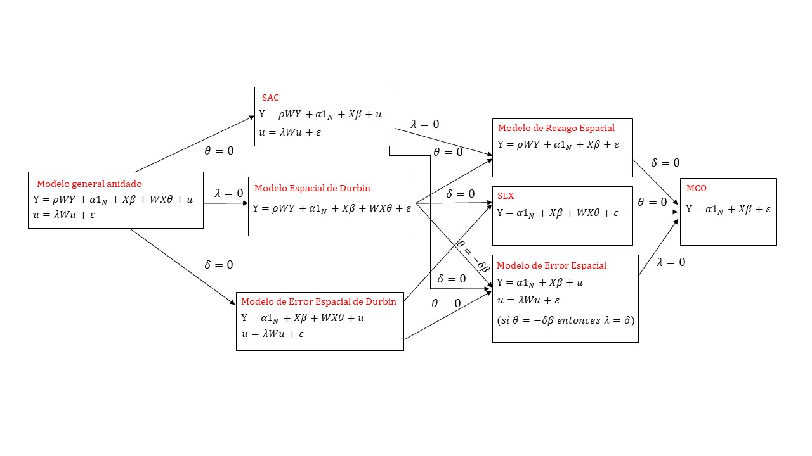
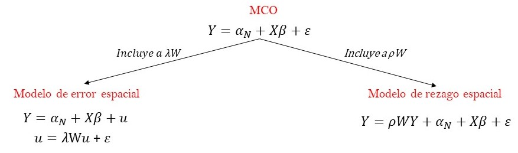

# Análisis espacial II: modelos econométricos espaciales

<div style="text-align: justify">
En el capítulo 3 nos hemos referido a la necesidad de identificar la presencia de autocorrelación espacial en el conjunto de información utilizado. Mencionamos que dos son las razones por las que conviene saber si la información usada presenta este rasgo: una técnica y otra sustantiva. En términos de la segunda, la presencia de autocorrelación espacial significa que el fenómeno de interés de no se distribuye de manera aleatoria en el espacio por lo que *algo* está pasando que debe ser investigado. En términos de la razón de carácter técnico, que no está desvinculada necesariamente a la razón previa, estimar un modelo clásico de regresión lineal a través del método usual de Mínimos Cuadrados Ordinarios implicaría violar uno de sus supuestos, específicamente, aquel que tiene que ver con la independencia de los términos de error. Por tanto, por razones de la técnica utilizada y del interés de investigador, es necesario recurrir a una alternativa de modelación que permita tanto resolver el problema de la violación del citado supuesto como poner a disposición del interesado información relevante para buscar las causas que explican la distribución no aleatoria del fenómeno en el espacio.

En este capítulo nos dedicaremos a mostrar dos de las alternativas para lograr lo anterior a través de los llamados modelos econométricos espaciales. Es crucial que, antes de abordar este capítulo, hayan quedado plenamente asimilados los contenidos del capítulo 3 y 4, en la medida en que lo expuesto aquí se basa en los conocimientos previos.

## Diversas alternativas de modelos econométricos
<div style="text-align: justify">
Existen múltiples modelos econométricos que buscan resolver las dos cuestiones mencionadas a través de captar las interacciones que se dan en el espacio, más aún, dichas interacciones las hay de diferente naturaleza. El modelo que incorpora todas las posibles interacciones espaciales recibe el nombre de **Modelo General Anidado** (*General Nesting Spatial Model* [@Elhorst2006,p. 7] y puede ser escrito como:

$$
\begin{aligned}
Y &= \rho WY +\alpha1_N+X\beta+WX\theta+u  \\
u &=\lambda Wu+\epsilon  \\
\end{aligned}
$$

Las interacciones espaciales en la expresión anterior son de tres tipos: i) efectos de interacción endógenos, es decir, cuando la variable dependiente reaparece como independiente pero a través de su rezago espacial ($WY$), aquí el sentido y magnitud de la interacción está dado por $\rho$; ii) efectos de interacción exógenos, es decir, cuando las variables independientes son incluidas en forma de sus rezagos espaciales ($WX$) en la que la relación es captada por $\theta$; iii) efectos de interacción dados por los términos de error de la regresión ($Wu$) e interesa el sentido y magnitud de $\lambda$.

A partir de este modelo general es posible derivar otros, más simples, si se suponen determinados valores para los coeficientes. Toda la constelación de modelos espaciales posibles aparece en la siguiente figura [@Elhorst2006,p. 7]:

```{r, echo=FALSE, fig.align='center',out.width='100%',fig.cap='Clasificación de modelos espaciales, Elhorst (2006)'} 

```

De toda esta gama de modelos aquí sólo nos ocuparemos de dos de ellos, el **modelo de rezago espacial** y el **modelo de error espacial**, siguiendo la ruta metodológica propuesta por Anselin y Rey [@Anselin2014] que consiste en comenzar con un modelo lineal no espacial estimado con mínimos cuadrados ordinarios (MCO) que luego es extendido con la incorporación de interacciones espaciales, ya sea a un modelo de rezago espacial o a uno de error, con base en pruebas que verifican alternativamente la pertinencia de cada uno:

```{r, echo=FALSE, fig.align='center',out.width='100%',fig.cap='De un modelo con MCO a un modelo espacial'} 

```

Después de haber llevado a cabo el análisis exploratorio de datos espaciales (ESDA) y que se ha decidido modelar a través de econometría la relación de interésla secuencia general para la estimación de un modelo econométrico espacial consiste en:  

i) Estimar un modelo clásico de regresión lineal con mínimos cuadrados ordinarios.  
ii) Evaluar la presencia de autocorrelación espacial en los errores del modelo.  
iii) Evaluar, alternativamente, la pertinencia de un modelo de rezago o de error espacial.  
iv) Estimar el modelo de rezago y de error espacial y seleccionar el mejor modelo.

El punto *i)* ha sido tratado en el capítulo 4 a la regresión lineal. Si bien podrías pensar que la evaluación de la autocorrelación ha quedado plenamente cubierta en el capítulo 3 correspondiente al análisis exploratorio de datos espaciales, es necesario distinguir entre autocorrelación en la variable de interés y autocorrelación en los errores del modelo; esto último se mecionó dentro de los supuestos del modelo clásico de regresión lineal y es momento de evaluar formalmente dicho supuesto través de la I de Moran.

La evaluación sobre las alternativas de los modelos de error y de rezago corren a cargo de los estadísticos de prueba de los multiplicadores de Lagrange, también referidos como Prueba de Puntaje de Rao (*Rao score test*). Las pruebas nos permitirán decidir qué modelo es mejor, evaluándolos de siguiente modo:

* Modelo MCO vs. Modelo de rezago  
* Modelo MCO vs. Modelo de error  

Evaluar entre el modelo de MCO y el modelo de rezago implica recordar la estructura del modelo de rezago:
$$
y=\rho Wy+X\beta+u 
$$
así, formalmente el juego de hipótesis a evaluar sobre la expresión anterior es:

$$
\begin {aligned}
Ho &: \rho=0 \\
Ha &: \rho\not=0 \\
\end {aligned}
$$

El estadístico usado es el multiplicador de Lagrange, que sigue una distribución $\chi^2$ con un grado de libertad[^5]. Así, dado determinado nivel de significancia, rechazar la hipótesis nula significará que el mejor modelo es un modelo de rezago espacial. De forma semejante, para evaluar la alternativa del modelo de error recuerda que:


$$
\begin{aligned}
Y &= \alpha1_N+X\beta+u  \\
u &=\lambda Wu+\epsilon  \\
\end{aligned}
$$

de modo que las hipótesis a verificar son:

$$
\begin {aligned}
Ho &: \lambda=0 \\
Ha &: \lambda\not=0 \\
\end {aligned}
$$
Igualmente, el estadístico usado para evaluar nuestras hipótesis es el multiplicador de Lagrange que sigue una distribución $\chi^2$ con un grado de libertad, por lo que fijado determinado nivel de significancia, rechazar la hipótesis nula implica que el mejor modelo es un modelo de error espacial.  

Pero, ¿qué ocurre cuando tanto la prueba sobre la versión de rezago y de error han resultado significativas? En este caso, se recurre a las versiones robustas de los multiplicadores de Lagrange. Las versiones robustas de dichos indicadores implican "que el estadístico original es corregido mediante la influencia potencial de 'otras' alternativas" (Anseluin y Rey, 2014: 105). En un sentido estrictamente práctico, de nueva cuenta, se evalúa alternativamente el modelo MCO vs. el de rezago, y el MCO vs. el de error, pero esta vez, con las versiones robustas con exactamente los mismos juegos de hipótesis.

Lo dicho anteriormente dicho es sintetizado por nuestro autores en el siguiente esquema:

```{r, echo=FALSE, fig.align='center',out.width='100%',fig.cap='Árbol de decisión de regresión espacial, Anselin y Rey (2014)'} 
knitr::include_graphics("recursos 5/figura 3.jpg")
```

Para simplificar el proceso de selección entre los modelos alternativos, basta recordar lo recomendado por [@Anselin2005, p. 197]:

>Lo importante a recordar es considerar las versiones robustas de loss estadísticos (los multiplicadores de Lagrange) sólo cuando las versiones estándar son significativas

## Modelos espaciales en R: un ejemplo para el Valle de México
<div style="text-align: justify">
Los paquetes utilizados para la estimación de modelos econométricos espaciales son:

* `spatialreg`: contiene las funciones para calcular modelos espaciales.  
* `spdep`: funciones para evaluar dependencia espacial y construir matrices de pesos espaciales.  

Como es usual, la instalación desde la consola puede hacerse con:

```{r, eval = FALSE}
#Instalar dos paquetes
install.packages(c("spdep", "spatialreg" ))
```

Además, echaremos mano de otros tantos paquetes previamente trabajadas, por lo que deberán ser llamadas junto con los recién instalados:

```{r message=FALSE}
#Paquetes recien instalados
library(spdep)
library(spatialreg)
#Otros paquetes usados
library(rgdal)
library(sp)

```

La base de datos a usar en este ejercicio es la misma que hemos usando antes y que puedes [descargar aquí](https://bit.ly/covidSHP). Cargue su base de datos espacial con:

```{r}
covid_zmvm <-rgdal::readOGR("base de datos\\covid_zmvm shp\\covid_zmvm.shp")
```

Como recordarás del capítulo relativo al análisis exploratorio de datos espaciales, la definición de una estructura espacial atraviesa por la construcción de una matriz de pesos espaciales, recuerda que a través de la función `poly2nb()` del paquete `spdep` construimos nuestra lista de vecinos con base en los criterios de contigüidad de tipo reina (`queen=TRUE`):

```{r}
mTRUE <- spdep::poly2nb(covid_zmvm)
```

Ahora, el objeto de tipo `nb` debe ser trasformado a uno que contenga los pesos espaciales, es decir, la matriz ponderada: un objeto de tipo `listw`:
 
```{r}
mTRUE.pesos<-spdep::nb2listw(mTRUE)
```
 
Visualicemos la estructura de dependencia espacial:

```{r}
plot(covid_zmvm)
plot(mTRUE, coordinates(covid_zmvm), add=TRUE, col="blue")
```

Sólo con el afán de recordar los elementos previamente revisados en el análisis exploratorio de datos, construyamos el estadístico de correlación espacial global sobre la variable crimen, `pos_hab`:

```{r}
spdep::moran.test(covid_zmvm$pos_hab, mTRUE.pesos)
```

Y el respectivo diagrama de Moran:

```{r}
spdep::moran.plot((covid_zmvm$pos_hab-mean(covid_zmvm$pos_hab))/sd(covid_zmvm$pos_hab), listw = mTRUE.pesos, xlab="Casos positivos por cada 100 mil habitab¿ntes", ylab="Promedio de casos positivos en regiones vecinas", main="Diagrama de Moran de los casos positivos en el Valle de México", col="blue")
```

------------------------------------------------------------------------

**Ejercicio**

Interpreta tanto la I de Moran como su diagrama, ¿hay evidencia de autocorrelación espacial? Si es así, ¿de qué magnitud y sentido? ¿Cómo interpretarías el estadístico obtenido?

------------------------------------------------------------------------

De acuerdo a lo dicho líneas más arriba, primero debemos estimar un modelo clásico de regresión lineal con mínimos cuadrados ordinarios. Usaremos el mismo modelo del capítulo sobre regresión lineal en su versión simple: un modelo que busca explicar los casos positivos por COVID-19 por cada 1 mil habitantes (`pos_hab`) mediante la población con acceso a servicios de salud (`ss`):

```{r}
modelo_mco <- stats::lm (formula=pos_hab ~ ss, data = covid_zmvm)
summary(modelo_mco)
```

------------------------------------------------------------------------

**Ejercicio**

¿Qué puedes decir sobre la significancia individual del coeficiente estimado? ¿Qué sobre la bondad de ajuste del modelo?

------------------------------------------------------------------------

Una vez que hemos estimado el modelo lineal a través del MCO, debemos evaluar la presencia de autocorrelación espacial en los errores del modelo. De nueva cuenta insistimos en la diferencia entre evaluar la autocorrelación sobre la variable de interés (lo que hicimos hace un momento con la I de Moran y su diagrama sobre la variable `pos_hab`) y evaluar la autocorrelación sobre los errores del modelo, lo que haremos en este momento.

Verificamos la presencia de autocorrelación espacial de los errores a través de la I de Moran, lo que nos permitirá responder a la pregunta ¿los errores de nuestro modelo están correlacionados? Para ello, nos servimos de la función `moran.test()` del paquete `spdep`. Como recordarás, la función requiere dos argumentos: el vector número a evaluar (en este caso los errores del modelo MCO) y la estructura espacial:

```{r}
spdep::moran.test(modelo_mco$residuals, mTRUE.pesos)
```

------------------------------------------------------------------------

**Ejercicio**

Con base en los resultados de la I de Moran, ¿dirías que existe autocorrelación espacial en los errores?

------------------------------------------------------------------------

Lo usual es que cuando la variable de interés presenta autocorrelación, esta característica termine por afectar los resultados de la estimación por mínimos cuadrados ordinarios. Así pues, es necesario, siguiendo la ruta marcada por Anselin y Rey (2014), evaluar, alternativamente, la pertinencia de un modelo de rezago o de error espacial. Como dijimos antes, esto lo haremos con base en las pruebas sobre las dos alternativas propuestas (modelo de rezago o modelo de error), a través de los mutiplicadores de Lagrange lo que nos permitirá tener elementos informativos para decantarnos por alguna de estas opciones.

Las pruebas son llamadas con la función `lm.LMtests()` del paquete `spdep` que requiere de los siguientes argumentos: el modelo lineal a evaluar (`model=`), la estructura espacial (`listw=`) y los pruebas solicitadas (`test=`):

```{r}
spdep::lm.LMtests(model=modelo_mco, listw=mTRUE.pesos, test=c("LMlag","LMerr", "RLMlag","RLMerr"))
```

Revisa la ayuda relacionada con la función `lm.LMtests()` para familiarizarte con todos sus argumentos. En este caso, solicitamos las 4 pruebas de las que hicimos mención previamente: la prueba del multiplicador de Lagrange sobre la alternativa del modelo de rezago (`LMlag`), la prueba del multiplicador de Lagrange sobre la alternativa del modelo de error (`LMerr`), así como sus respectivas versiones robustas (`RLMlag`,`RLMerr`). 

Interpretemos los resultados. Primero, contrastemos las versiones sencillas de los multiplicadores:

|       | Estadístico | valor-p   |
|-------|-------------|-----------|
| LMlag | 55.313      | 1.028e-13 |
| LMerr | 42.733      | 6.275e-11 |

Tanto el estadístico vinculado al modelo de rezago, como el del error son estadísticamente significativos, es decir, en cada caso se rechaza la hipótesis nula de que $\rho=0$ y $\lambda=0$, respectivamente, por lo que tanto un modelo de rezago como de error son plausibles. En este caso, hay que mirar los resultados de las versiones robustas para tomar la decisión final:

|        | Estadístico | valor-p   |
|--------|-------------|-----------|
| RLMlag | 13.358      | 0.0002573 |
| RLMerr | 0.77786     | 0.3778    |


Sólo el estadistico vinculado al modelo de rezago, `RLMlag`, resulta significativo, es decir, se rechaza la hipótesis nula de que $\rho=0$; en tanto, para el caso del estadístico vinculado al modelo de error, `RLMerr`, no podemos rechazar la hipótesis nula de que $\lambda=0$, así, la mejor alternativa espacial al modelo de MCO es el modelo de rezago. Revisa de nueva cuenta la figura 5.3 para mejor entender nuestra decisión.

Finalmente, vamos a estimar ambos modelos, aunque a sabiendas de que el mejor es el modelo de error, lo usual es presentar los resultados de ambos. 

## Modelos espaciales

### Modelo de rezago espacial
<div style="text-align: justify">
El modelo de rezago espacial se invoca con al función `lagsarlm()` del paquete `spatialreg` en la que la estimación corre a cargo del método de máxima verosimilitud. En la función se especifica el modelo (`formula=`), la base de datos (`data=`) y la estructura espacial (`listw=`).


```{r message=FALSE}
library(spatialreg)
rezago <- spatialreg::lagsarlm(formula=pos_hab ~ ss, data=covid_zmvm, listw=mTRUE.pesos)
summary(rezago)
```

De la salida debemos llamar la atención sobre los coeficientes de interés:  $\rho$, el coeficiente de autocorrelación espacial que en este caso es positivo, significativo y alto, 0.83, esto significa que cuando aumenta en 1 el número de casos positivos en los municipios y alcaldías vecinas, el número de casos positivos por COVID19 por cada 1 mil habitantes en el municipio de interés aumentará en 0.83.  

De forma semejante, los errores pueden ser visualizados, guardados y evaluados para ver si presentan autocorrelación:

```{r}
spdep::moran.test(rezago[["residuals"]], mTRUE.pesos)
```

------------------------------------------------------------------------

**Ejercicio**

Con base en los resultados de la I de Moran, ¿diría que persite el problema de autocorrelación espacial en los errores en el modelo de rezago?

------------------------------------------------------------------------


### Modelo de error espacial
<div style="text-align: justify">
El modelo de error espacial es llamado con la función `errorsarlm()` y los argumentos son los mismos:

```{r message=FALSE}
error <-  spatialreg::errorsarlm(formula=pos_hab ~ ss, data=covid_zmvm, listw=mTRUE.pesos)
summary(error)
```

Aquí, el parámetro de interés estimado es $\lambda$. Verifique si se ha resuelto el problema de la autocorrelación espacial en los errores:


```{r}
spdep::moran.test(error[["residuals"]], mTRUE.pesos)
```

Con estos resultados hemos completado la ruta más elemental para la estimación de modelos econométricos espaciales. Sin embargo, hay no sólo otras tantas alternativas de modelación, tal y como apuntamos en la figura 5.1. Además, hay una serie de tópicos que quedan fuera de estas notas, tales como la modelación de heterogeneidad espacial (violación del supuesto de homoscedasticidad), así como la incorporación de la dimensión temporal a nuetro análisis, a través de los modelos de panel espacial. Cada uno de estos temas implica un estudio sistemático por sí sólo. Esperamos que estas notas contribuyan a alimentar tu curiosidad sobre el tratamiento y análisis de información espacial y que sean un primer paso en tu formación como profesionista especialista en economía urbana y regional.


[^5]: Para una exposición detallada de la formulación de los multiplicadores de Lagrange para la selección de modelos alternativos consulta Anselin y Rey (2014: 104)


